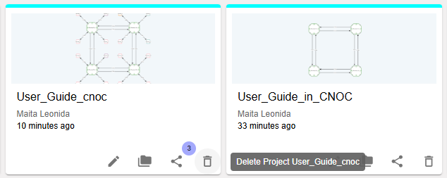

Delete Project
==================================================

To delete a project, navigate to the Dashboard and select the project you wish to remove. Click the Delete Project icon to initiate the deletion process. A confirmation prompt may appear to ensure the action is intentional.

Upon clicking the Delete Project button, a confirmation dialog will appear. Click Delete to confirm and proceed with the project deletion.

.. image:: images/delete_project-confirmation_window.png
  :alt: delete_project-confirmation_window
  :align: center

**Notes:**

  - Before deleting a project, ensure that any important data is backed up or shared. This is critical if the project contains valuable information that may be needed in the future.

  - Verify that you have selected the correct project, as deletion is irreversible.

  - Communicate with your team prior to deletion, especially if others rely on the project for their work.
