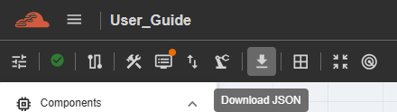
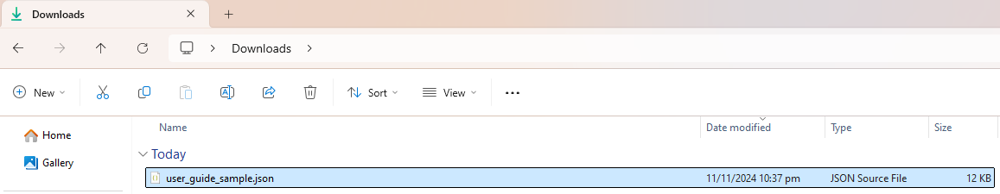

Download JSON
===============================================

This feature allows the user to download the current topology as a JSON file. The Download JSON option is available in both C-NoC and NC-NoC projects.

This feature’s availability depends on your account permissions. Please contact your group administrator for access, as this function is managed at the group administration level.
