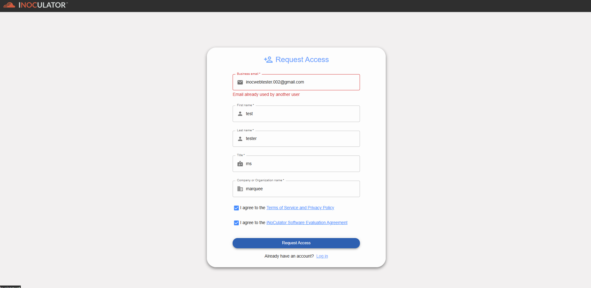

Duplicate Email 
==============================================
If an email address is already linked to an existing account, the system will:

  - Detect duplication by identifying that the email address is already in use.
  - Provide a warning to inform the user that the email address is associated with an existing account.
  - This behavior occurs when submitting the Request Access form.

This will be encountered in Request Access form.

**Managing Duplicate Email Addresses**
If you encounter a duplicate email warning, please:

  - Verify with support whether an account has already been created using that email address.
  - Provide a different email address to proceed with the request.

