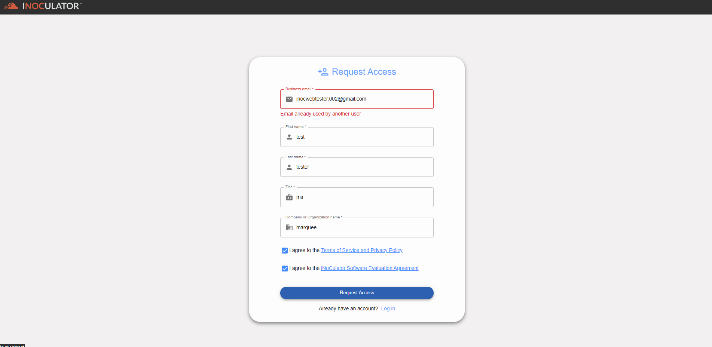

==============================================
Handling Duplicate Email Registration
==============================================

During the account registration or workspace onboarding process, the platform enforces strict user-identity mapping. If you input an email address that is already active or pending inside the system database, the validation engine will immediately flag the conflict.

--------------------------------------------------------------------------------

🔍 System Validation Behavior
==============================

When you submit a new application via the **Request Access** form, the authentication layer automatically scans existing identity records.

> **Duplication Conflict Detection:** If an identical email string is found, the system halts form processing and populates an inline validation warning banner directly beneath the email field. This safeguard blocks duplicate profiles from corrupting team workspace permissions.

--------------------------------------------------------------------------------

🛠️ Resolution Paths for Users
===============================

If the interface displays a duplicate email address error during your registration workflow, adopt one of the standard recovery paths detailed below:

.. warning::
   **Recommended Resolution Actions:**
   
   * **Audit Existing Credentials:** You or an administrator may have already initialized an account profile under this address. Try navigating back to the login portal and using the *Forgot Password* link to recover access.
   * **Contact System Administration Support:** Connect directly with your organization's IT helpdesk or platform administrator. Request that they audit the active user roster to verify if an account stub or stale invite is already consuming your target corporate email address.
   * **Provide an Alternate Identity String:** If your primary address is dedicated to a distinct workspace or system profile, provide an alternative valid email address in the input field to complete your access request registration.
