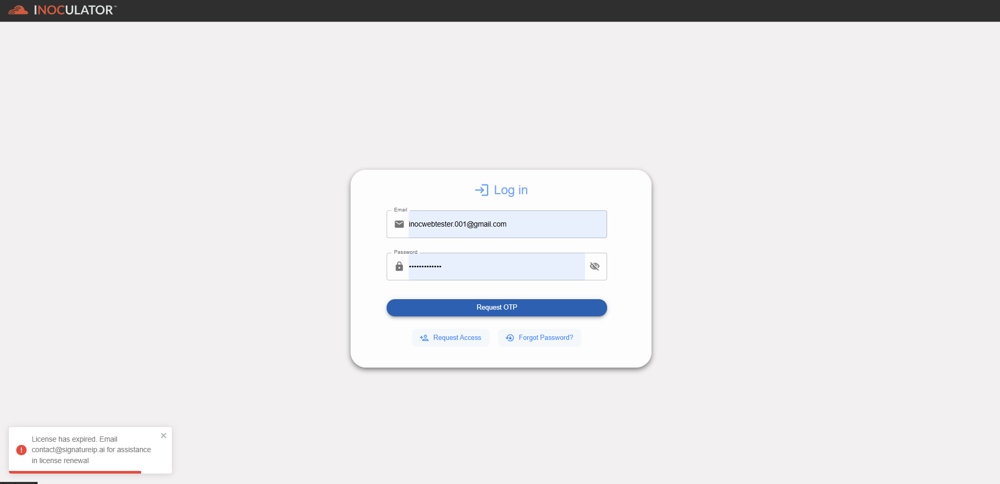

Expired Account 
==========================================================
An expired account is an account that has reached the end of its active period, typically due to a time-based condition such as the expiration of a subscription, membership, or license.

To resolve this issue, please contact your Group Administrator or Signature IP Administrator to update or renew the account’s License Expiry Date.

