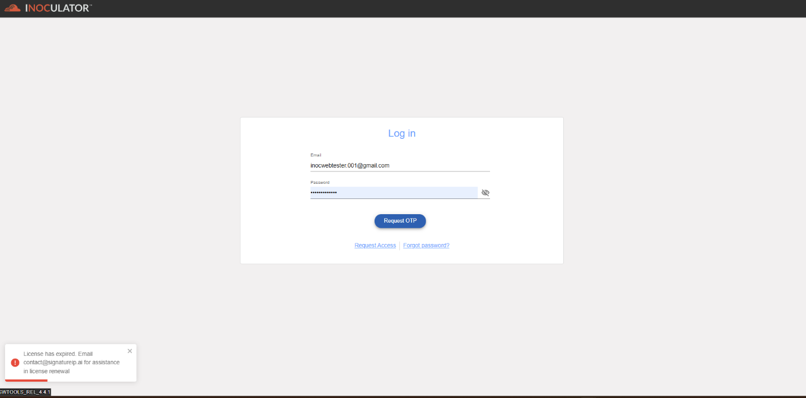

Authorization - Expired Account 
==========================================================
An expired account refers to an account that has reached the end of its active period, often due to a time-based condition, such as the expiration of a subscription, membership, or license. 
------------------------------------------------------------------

  [alt] authorization-expired_account

To resolve this, please contact the Group Admin or Signature IP Administrators to update or renew the account's License Expiry Date.
