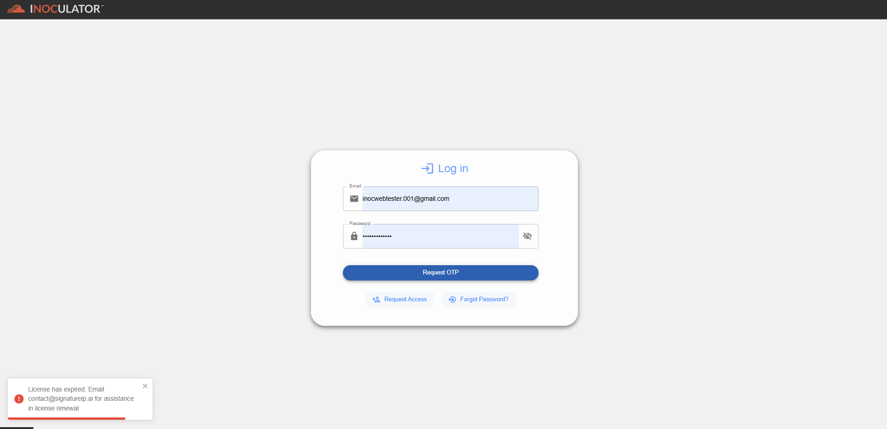

==========================================================
Account Expiration and License Renewal
==========================================================

An account enters an **Expired** state when its active runtime window closes. This typically occurs due to time-based contractual boundaries, such as the natural conclusion of a product evaluation period, a corporate membership shift, or an enterprise license agreement expiration.

--------------------------------------------------------------------------------

System Authentication Behavior
==================================

When an account lifecycle window closes, the platform's central authentication layer blocks access to the design workspace. 

> **Access Interception:** Upon attempting to log in, the user is automatically redirected to a secure landing interface displaying an explicit account expiration warning badge. All background design operations, API keys, and active simulations are safely paused until the license is renewed.

--------------------------------------------------------------------------------

Resolution and Renewal Pipeline
====================================

Because account expiration is directly tied to platform-level software licensing, users cannot self-remedy this state from the standard account settings panel. 

.. important::
   **Required Restoration Steps:**
   
   To restore full read/write access to your Network-on-Chip design canvas and project records, please coordinate with your authorized organization leads to update the registration database:
   
   * **Contact your Group Administrator:** Reach out to your internal engineering team lead or department manager who handles localized seats and seat allocations.
   * **Escalate to Signature IP Administration:** If you are the primary site contact or an enterprise account holder, contact your dedicated **Signature IP Account Executive** or system support engineer to formalize a license renewal or update the system-wide **License Expiry Date** stamp.
