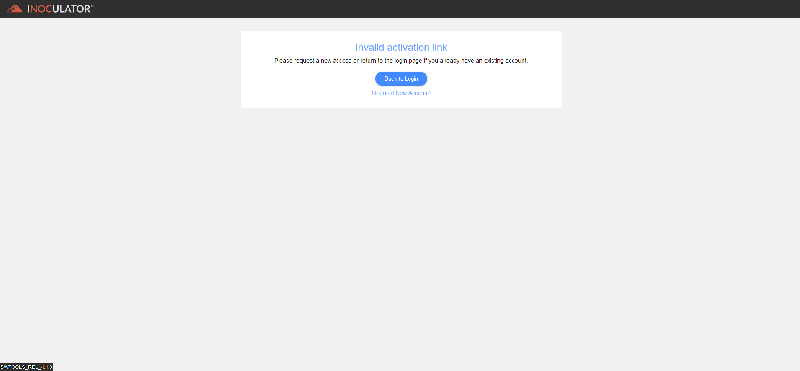

Expired Activation Link
================================================

Activating an account with an expired link occurs when a user tries to activate or verify their account using an email link that has passed its validity period.

**Managing Activation with an Expired Link**
If your activation link has expired, please follow one of the steps below:

  - Request a new activation email from support.

  - Contact support directly for assistance with account activation.
