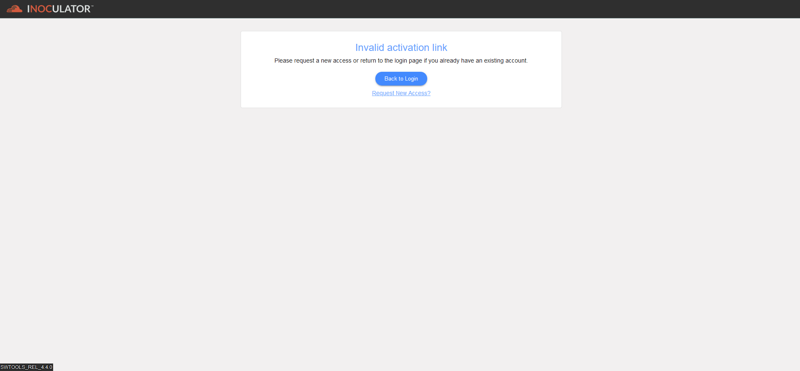

================================================
Expired Activation Link Resolution
================================================

An **Expired Activation Link** error occurs when a user attempts to verify and initialize their newly provisioned profile using an email registration token that has surpassed its configured security validity window.

--------------------------------------------------------------------------------

🔒 System Security & Link Expiry Behavior
=========================================

To safeguard corporate engineering workspaces and prevent unauthorized account hijacking, the system applies a strict time-to-live (TTL) timestamp to all email verification tokens. 

> **Security Interception:** If a user clicks the verification button after this temporary window closes, the database invalidates the registration handshake and redirects the browser to a dedicated security alert interface.

--------------------------------------------------------------------------------

🛠️ Standard Account Recovery Paths
====================================

Because an expired security token cannot be manually overridden or extended, you must initiate a new authentication handshake to complete your onboarding workflow.

.. important::
   **How to Request a Fresh Onboarding Token:**
   
   If you encounter this verification timeout page, adopt one of the standard recovery paths detailed below:
   
   * **Trigger a New Activation Token:** Return to the primary login portal or application submission confirmation page, and click the option to re-send the registration email. This will dispatch a fresh, active verification link directly to your inbox.
   * **Contact System Administration Support:** If the self-service request option is unavailable or fails to deliver a new email, contact your internal IT helpdesk or connect directly with the **Signature IP Platform Support Team** to have an administrator manually authorize your account profile.
