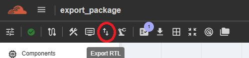
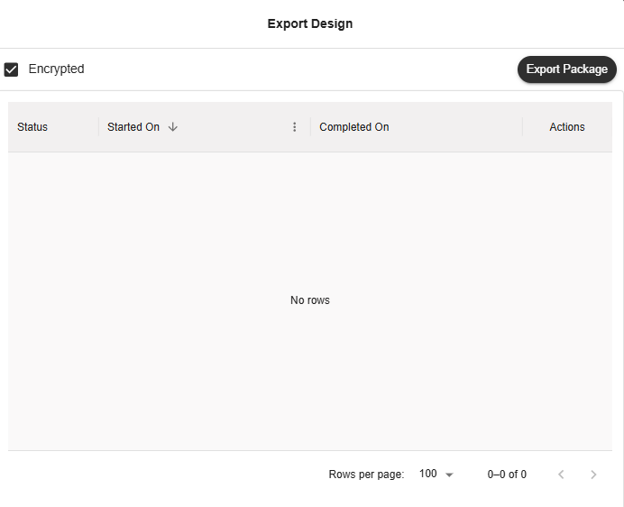
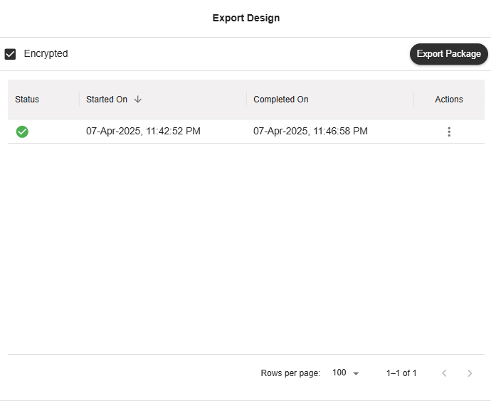
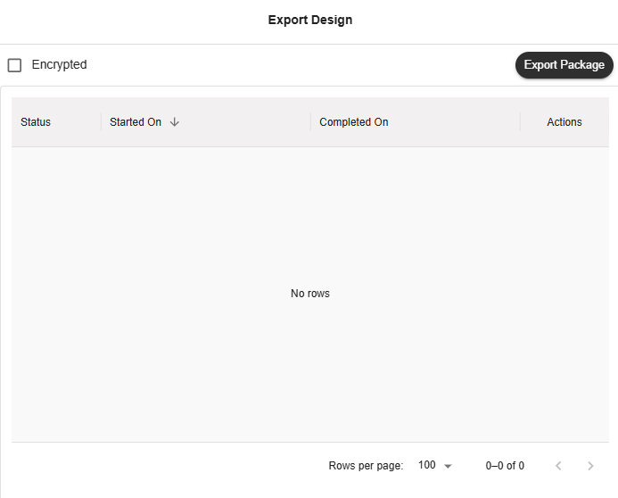
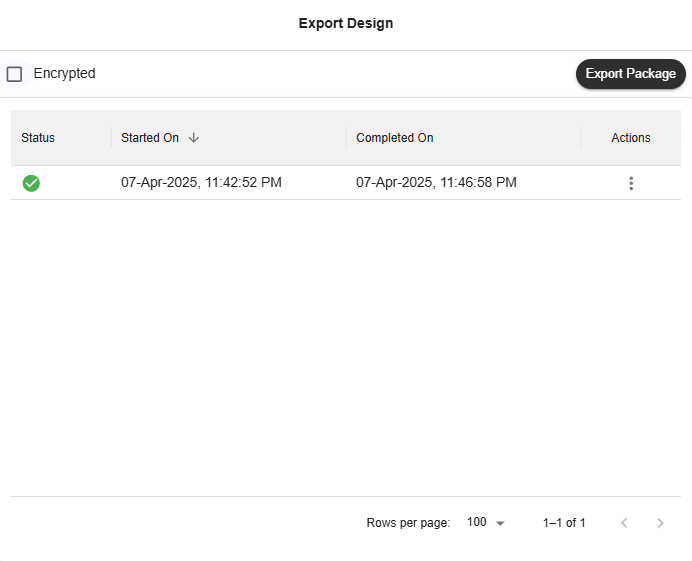
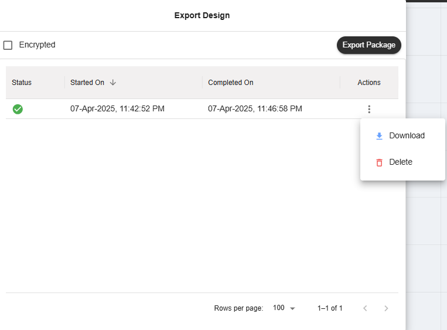

Export Package
========================================

iNoCulator offers two types of export packages: Encrypted and Unencrypted.
The type of package depends on the settings of the group the user belongs to. This function is available for NC-NoC projects.

Encrypted Package 
-------------------------------------------------------

To export an 'Encrypted' package, tick the checkbox within the Export button in the Action Bar.

Click the 'Export Package' button to export the RTL, and wait for the result in the Export Design table.

Clean Package 
------------------------------------------------------------------------------

To export a 'Clean' package, untick the checkbox inside the Export button in the Action Bar.

Click the 'Export Package' button to export the RTL, and wait for the result in the Export Design table.

Results
---------------------------------------------------------------------

In the Export Design table, each package result has an 'Actions' column. Click the three dots in this column to choose an action.

Select 'Download' to download the exported RTL result for the selected file.
Select 'Delete' to remove the selected file from the Export Design table.

