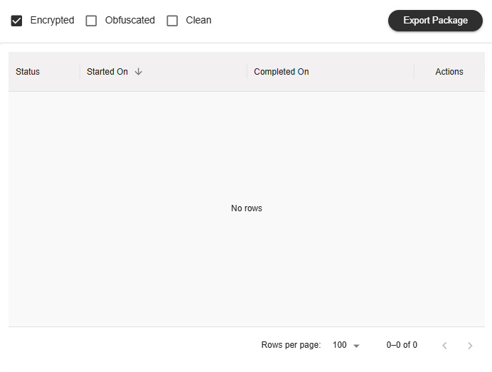
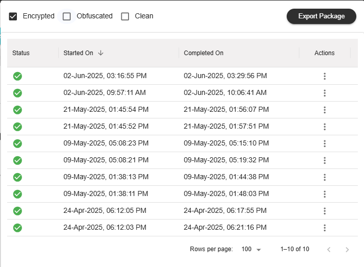
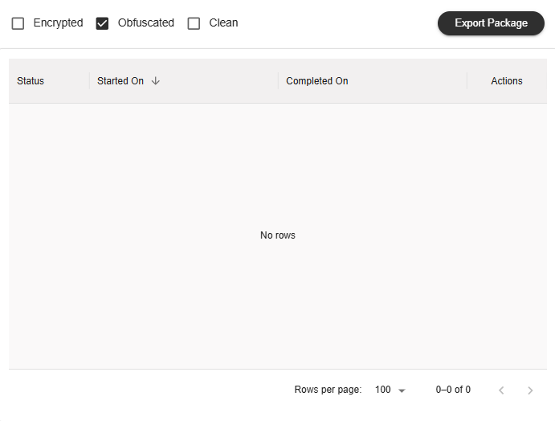
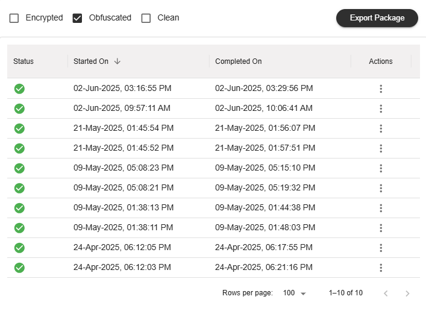
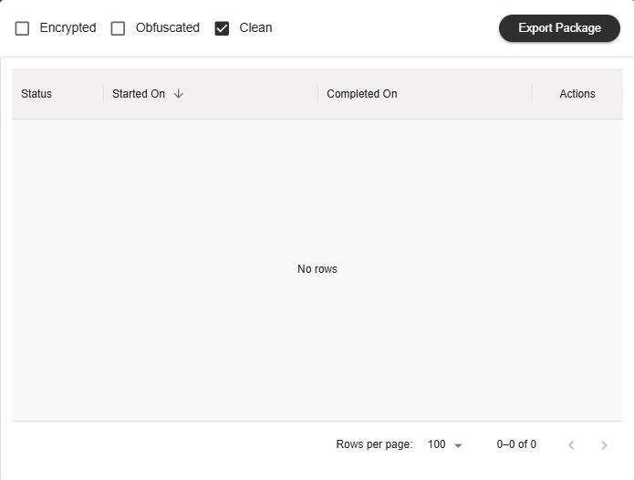
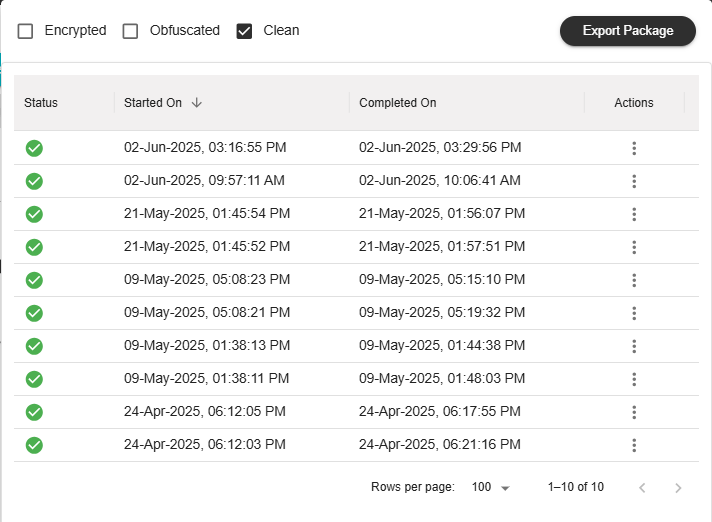
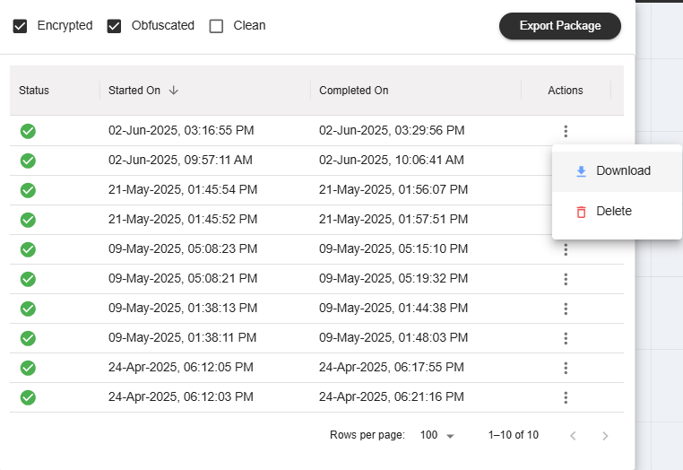

Export Package
========================================

iNoCulator offers three types of export packages: Encrypted, Obfuscated and Clean.
The type of package depends on the settings of the group the user belongs to. This function is available for NC-NoC and C-NoC projects.

Users can select which package to export from the table. Up to three packages can be run simultaneously, if available.

Encrypted Package 
-------------------------------------------------------

To export an 'Encrypted' package, tick the 'Encrypted' checkbox inside the Export Package table. 

.. image:: images/export_package_button.png
  :alt: export_package_button
  :align: center

Click the 'Export Package' button to export the RTL, and wait for the result in the Export Design table.

Obfuscated Package
-------------------------------------------------------------------------------------------

To export an 'Obfuscated' package, tick the box for Obfuscated inside the Export Package table.

.. image:: images/export_package_button.png
  :alt: export_package_button
  :align: center

Click the 'Export Package' button to export the RTL, and wait for the result in the Export Design table.

Clean Package 
------------------------------------------------------------------------------

To export a 'Clean' package, tick the 'Clean' checkbox inside the Export Package box. 

.. image:: images/export_package_button.png
  :alt: export_package_button
  :align: center

Click the 'Export Package' button to export the RTL, and wait for the result in the Export Design table.

Results
---------------------------------------------------------------------

In the Export Design table, each package result has an 'Actions' column. Click the three dots in this column to choose an action.

Select 'Download' to download the exported RTL result for the selected file.
Select 'Delete' to remove the selected file from the Export Design table.

