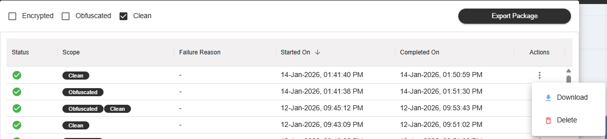
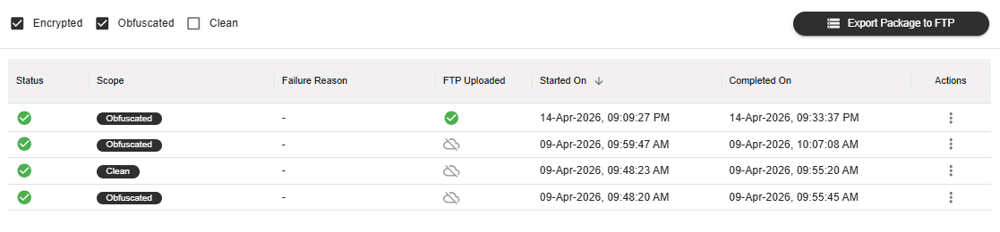

========================================
Exporting RTL Design Packages
========================================

The **Export Package** suite compiles your Non-Coherent NoC (NC-NoC) or Coherent NoC (C-NoC) topology configurations into deployable hardware IP deliverables. The specific package flavors accessible to your account are determined dynamically by your organizational group's subscription tier and security clearance profiles.

--------------------------------------------------------------------------------

RTL IP Package Formats
=========================

The system supports up to three distinct structural variants when packaging your compiled network design for synthesis and simulation pipelines.

.. list-table:: Available RTL Generation Profiles
   :widths: 20 50 30
   :header-rows: 1

   * - Package Type
     - Architectural & Functional Characteristics
     - Target Use Case
   * - **Encrypted**
     - Source code blocks are protected via hardware-standard IEEE encryption envelopes. Core functional algorithms remain hidden.
     - Early-stage vendor evaluations or protected testing sandboxes.
   * - **Obfuscated**
     - Human-readable code is systematically scrubbed. Signal identifiers, module labels, and logic routing paths are completely randomized.
     - Verification cycles where logic tracing is restricted but synthesis pipelines are required.
   * - **Clean**
     - Fully open, production-ready, human-readable source code featuring pristine formatting and fully documented signal buses.
     - Production sign-off, ASIC tape-out, or deep intra-system debugging.

.. note::
   **Parallel Processing Limits:** The platform's compilation cluster supports concurrency. You can select and generate up to **three separate packages simultaneously** if permitted by your group license boundaries.

--------------------------------------------------------------------------------

Package Generation Workflows
===============================

Select the tab matching your required output profile to see the specific check-box configuration path:

.. tab-set::

   .. tab-item:: Encrypted Package

      To compile a protected IEEE-encrypted bundle:
      
      1. Toggle open the export configuration window by clicking the **Export Package** button.
      2. Check the **Encrypted** selection box inside the generation row matrix.
      3. Click the primary **Export Package** button to dispatch the design to the compilation cluster.

      .. image:: images/export_package_button2.png
         :alt: Launching the Export Package configuration window panel
         :align: center
         :width: 50%

      .. image:: images/export_package_encrypted2.png
         :alt: Checking the Encrypted format modifier checkbox option
         :align: center
         :width: 50%

      Monitor your background build progression directly from the **Export Design** tracking table.

      .. image:: images/export_package_encrypted_result3.png
         :alt: Successful compilation tracking entry within the Export Design matrix
         :align: center
         :width: 80%

   .. tab-item:: Obfuscated Package

      To compile a scrubbed, functionally randomized hardware bundle:
      
      1. Toggle open the export configuration window by clicking the **Export Package** button.
      2. Check the **Obfuscated** selection box inside the generation row matrix.
      3. Click the primary **Export Package** button to dispatch the design to the compilation cluster.

      .. image:: images/export_package_button2.png
         :alt: Launching the Export Package configuration window panel
         :align: center
         :width: 50%

      .. image:: images/export_package_obfuscated.png
         :alt: Checking the Obfuscated format modifier checkbox option
         :align: center
         :width: 50%

      Monitor your background build progression directly from the **Export Design** tracking table.

      .. image:: images/export_package_obfuscated_result2.png
         :alt: Successful compilation tracking entry within the Export Design matrix
         :align: center
         :width: 80%

   .. tab-item:: Clean Package

      To compile an open-source, production-ready tape-out bundle:
      
      1. Toggle open the export configuration window by clicking the **Export Package** button.
      2. Check the **Clean** selection box inside the generation row matrix.
      3. Click the primary **Export Package** button to dispatch the design to the compilation cluster.

      .. image:: images/export_package_button2.png
         :alt: Launching the Export Package configuration window panel
         :align: center
         :width: 50%

      .. image:: images/export_package_clean.png
         :alt: Checking the Clean format modifier checkbox option
         :align: center
         :width: 50%

      Monitor your background build progression directly from the **Export Design** tracking table.

      .. image:: images/export_package_clean_result2.png
         :alt: Successful compilation tracking entry within the Export Design matrix
         :align: center
         :width: 80%

--------------------------------------------------------------------------------

Managing Export Deliverables
================================

Every completed or active compilation job populates a tracking line inside the permanent **Export Design** table. Each row includes a dedicated contextual control hub.

Click the **three vertical dots (ellipsis)** icon in the *Actions* column to manage your generated file system:

* **Download:** Fetches the targeted compiled tarball or zip folder containing your complete RTL environment files directly to your machine storage.
* **Delete:** Permanently purges the selected package container block from your remote cloud workspace dashboard to clean up your repository index.

--------------------------------------------------------------------------------

Secure Server Delivery (Upload to FTP)
===========================================

For high-throughput delivery to automated continuous-integration (CI) pipelines or on-premise compute farms, the platform can stream build packages directly over network interfaces.

.. hint::
   **Automatic Activation:** The **Upload to FTP Server** action controls lock and unlock dynamically based on your enterprise group's global infrastructure profiles. Once your network administrator provisions valid server IP paths, port gates, and authorization tokens, this system control block lights up automatically inside your workflow dashboard, displaying live transfer states.

-------------------------------------------------------------------------------

Branch Selection in Task Windows [Export Package]
===================================================

The task window interface includes a branch selector that allows authorized users to target specific code/configuration branches directly within their active session.

Features & Access Control [Export Package]
---------------------------------------------

* **Visibility:** 
  The branch select dropdown is restricted and **visible only to internal users** belonging to authorized groups (`SignatureIP`, `SAdmins`, and designated internal groups). External or standard users will not see this control in the task window.
* **Default Branch:** 
  Upon initial load, the selector defaults to the active branch configured globally within the **admin page group settings**.
* **Persistence:** 
  Any manual branch selection made by a user is automatically saved to local storage (`localStorage`) to preserve their preference across sessions and window reloads.

UI & Configuration Reference [Export Package]
----------------------------------------------

.. list-table:: Task Window Branch Selector Properties
   :widths: 30 70
   :header-rows: 1

   * - Property
     - Description
   * - **Component Location**
     - Task window header / control panel toolbar.
   * - **Authorized Roles**
     - ``SignatureIP``, ``SAdmins``, internal group members.
   * - **Storage Key**
     - ``task_window_selected_branch``
   * - **Fallback / Default**
     - Admin page group active branch configuration.

Usage Example [Export Package]
-----------------------------------------

When an internal user opens a task window, the component checks user group permissions:

1. **Permission Check:** Validates if the user session contains internal privileges.
2. **State Initialization:** Reads from storage or falls back to the admin-defined active branch.
3. **Event Triggering:** Dispatches a ``taskBranchChanged`` event whenever a new branch is selected, updating downstream task processes dynamically.
