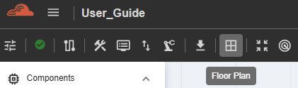

===================================================
Physical Floorplanning Workspace
===================================================

The **Floor Plan** panel provides an advanced physical design canvas under active engineering development for upcoming releases of the iNoCulator platform.

--------------------------------------------------------------------------------

Hardware-Aware Layout Framework
===================================

Future platform iterations will expand beyond purely logical network topologies into physical-aware design spaces. This bridge connects early architectural exploration directly with down-stream physical implementation and silicon place-and-route realities.

.. productionlist::
   Upcoming Capabilities: Automated Boundary Grouping & Wire Routing Trackers

--------------------------------------------------------------------------------

Roadmap Architecture Objectives
===================================

Once finalized, the integrated physical canvas will expose native controls to model and validate floorplan layouts directly within the tool:

.. list-table:: Floorplan Feature Pipeline
   :widths: 30 70
   :header-rows: 1

   * - Development Pillar
     - Expected Capability & System Value
   * - **Die Bound Allocation**
     - Define exact $(\Delta X, \Delta Y)$ chiplet dimensions, coordinate regions, and physical boundaries for single or multi-die configurations.
   * - **Macro Ring Placement**
     - Manually orient or snap router mesh clusters to match dedicated silicon macro regions and hard IP block constraints.
   * - **Physical Wire Fly-lines**
     - Track estimated physical trace flight lengths and cross-die channel pitches to predict wire routing congestion before running formal synthesis.
   * - **Timing Slack Estimator**
     - Leverage early resistance-capacitance ($RC$) approximations to isolate long-wire delays and insert register pipeline stages interactively.

.. hint::
   **Early Evaluation Tracking:** While the graphical placement parameters are locked against editing in the current platform revision, you can review early coordinate structures via the **Auto-Place** validation matrices. For current generation cross-die positioning workflows, see: :doc:`Topology Coordinates & Placement <cnoctopology>`.
