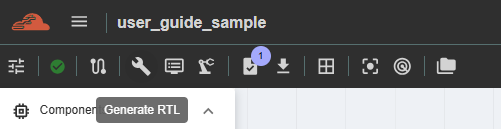
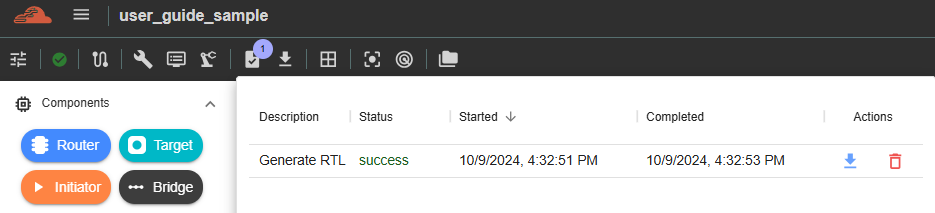
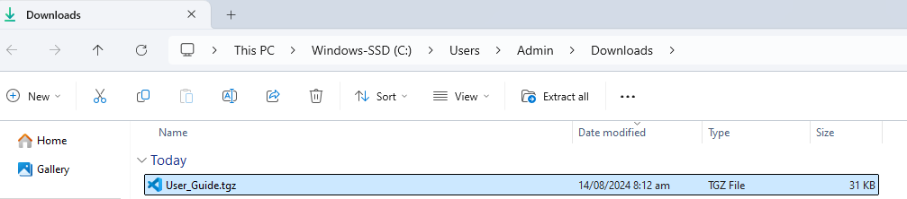
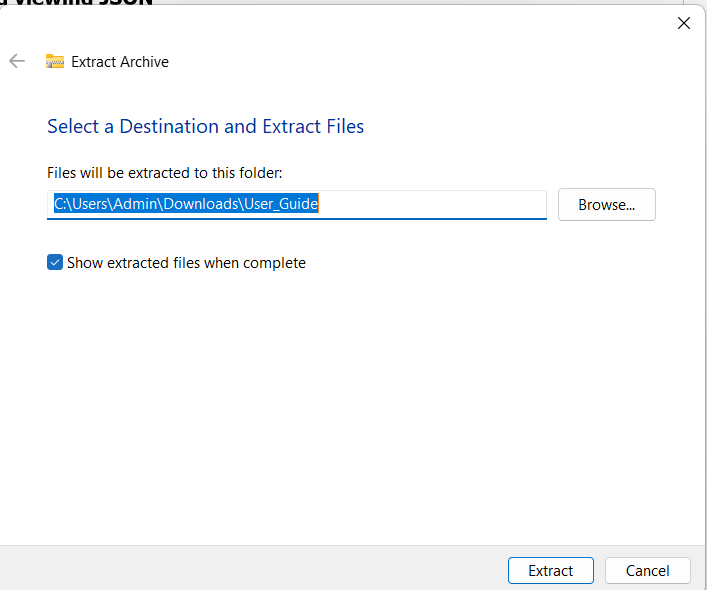
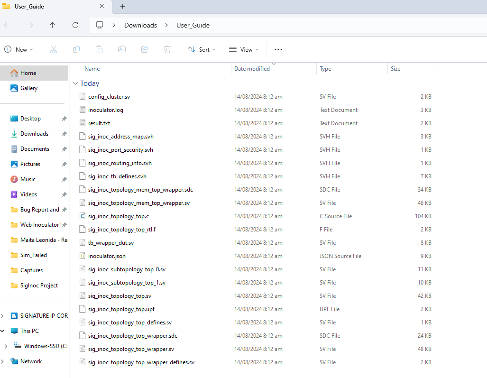
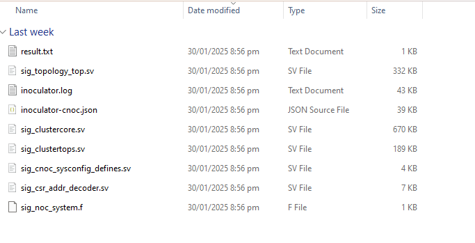

Generating RTL and Testbench
=========================================================

This feature is for generation of RTL Files and testbench for the created topology. To perform this function, user must click the ‘Generate RTL’ button in the side navigation, and the results will be displayed inside ‘Results’. 

**Downloading and viewing JSON**

This feature is available depending on account accessibility. Please contact your group admin regarding this function, as it is managed on the group-admin side.
(For C-NoC and NC-NoC) Once the button is enabled and functioning, it means the generated RTL and testbench can be downloaded to your machine for viewing. The downloaded file will be in .tgz format and must be extracted before the individual files can be viewed.

1. Downloaded file will be stored in Downloads folder of your machine. 

2. Right-click the file and select 'Extract All.' A new window will appear, allowing you to choose the folder name where all the extracted files will be saved.

3. After extracting, a new folder will be displayed and all the files downloaded will be shown. 

