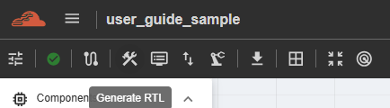

Generating RTL and Testbench
=========================================================

1. NC-NoC
----------------------------------------

This feature generates RTL files and a testbench for the created NC-NoC topology. To use it, the user must click the ‘Generate RTL’ button in the Action Bar, then click the ‘New’ button to start the generation. Results will be displayed in the same table, including timestamps for when the action started and completed.

 

.. image:: images/generate_rtl_actions.png  
  :alt: generate_rtl_actions
  :align: center

Each result includes an ‘Action’ column, where the user can choose to either ‘Download’ or ‘Delete’ the result. The download option depends on the license assigned to the user’s group.

2. C-NoC
------------------------------------------------

This feature is for generation of RTL Files and testbench for the created C-NoC topology. To perform this function, user must click the ‘Generate RTL’ button in the Action bar, and the results will be displayed inside ‘Results’. 

.. image:: images/c-noc_generateRTL.png
  :alt: c-noc_generateRTL.png
  :align: center

3. Download and viewing JSON
-------------------------------------------

This feature is available depending on account accessibility. Please contact your group admin regarding this function, as it is managed on the group-admin side.

(For C-NoC and NC-NoC) Once the button is enabled and functioning, it means the generated RTL and testbench can be downloaded to your machine for viewing. The downloaded file will be in .tgz format and must be extracted before the individual files can be viewed.

1. Downloaded file will be stored in Downloads folder of your machine. 

.. image:: images/downloading_generatertl_results.png
  :alt: downloading_generatertl_results
  :align: center

2. Right-click the file and select 'Extract All.' A new window will appear, allowing you to choose the folder name where all the extracted files will be saved.

3. After extracting, a new folder will be displayed and all the files downloaded will be shown. 

For NC-NoC generatedRTL files:

.. image:: images/generate_rtl_files_nc_noc-downloaded.png
  :alt: generate_rtl_files_nc_noc-downloaded
  :align: center

For C-NoC generatedRTL files:

.. image:: images/generate_rtl_files_c_noc-downloaded.png
  :alt: generate_rtl_files_c_noc-downloaded
  :align: center

