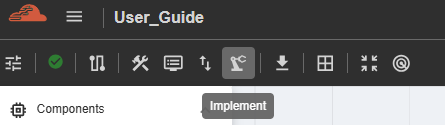
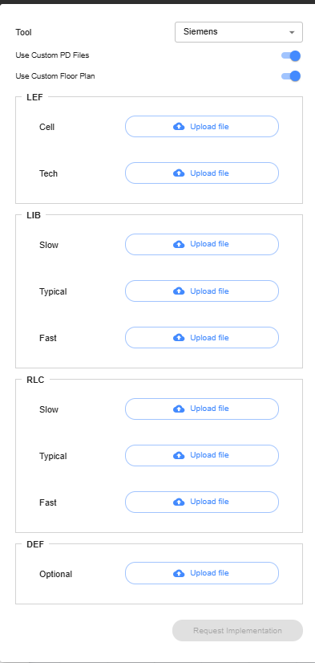

Implement
==============================

This feature is for preparing for fabrication. The user can select the required tool from the dropdown menu. Then, the user can choose either 'Use Custom PD (Physical Design Files)' or 'Use Custom Floor Plan' to upload the necessary files. After uploading, the user needs to click the 'Request Implementation' button to start the process. 

