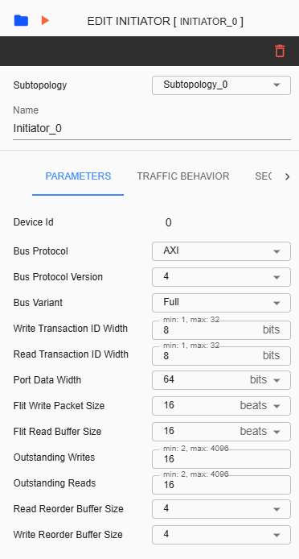

NC-NoC Topology
====================================================
  4. Initiator Configuration

Configuring an Initiator device involves various settings. The Settings tab includes sections for Parameters, Timing, Traffic Behavior, Security, and Others. The Timing section is available only if the 'Disable Frequency Validation' checkbox in the 'Create Project' settings is checked. The Traffic Behavior section is available only if the corresponding checkbox in the 'Create Project' settings is enabled. 

Subtopology – A dropdown list for changing subtopology assigned for the selected initiator. 
  
Name – Label name assigned for selected initiator. This is an input field where only alphanumeric keys and underscores are allowed.
  
Device ID – This ID is unique for each component.
  
Bus Protocol – The selected item here will be assigned as the protocol for the Initiator device. The available selections are AXI, AHB, APB, and SIG_NATIVE.

Bus Protocol Version – The list of versions depends in ‘Bus Protocol’ that has been selected. Please check the table below as reference.

Bus Variant – The list of variants for the selected 'Bus Protocol' will be displayed here. Please check the table below as reference. 

Write Transaction ID Width – Refers to the number of bits allocated to identify write transactions. 

Read Transaction ID Width – Refers to the number of bits used to identify read transaction. 

Port Data Width – Refers to the Data Width you will be assigned to the connected port.  Available list will depend on what Bus Protocol was selected. 

Flit Write Packet Size – Amount of data in beats that constitutes a single flit for write transactions. 

Flit Read Buffer Size – Capacity of a buffer dedicated to storing incoming flits during read operations. 

Outstanding Writes – The number of allowed outstanding writes limited by the system’s architecture. 

Outstanding Reads – The number of allowed outstanding reads limited to help manage the bandwidth. 

+------------------+--------------------------+----------------------+
| **Bus Protocol** | **Bus Protocol Version** |    **Bus Variant**   |
+==================+==========================+======================+
|      AXI         |           3              |          N/A         |
+------------------+--------------------------+----------------------+
|                  |           4              |  Full, Lite, Stream  |
+------------------+--------------------------+----------------------+
|      AHB         |           3              |        Lite          |
+------------------+--------------------------+----------------------+
|                  |           5              |          N/A         |
+------------------+--------------------------+----------------------+
|      APB         |           3              |          N/A         |
+------------------+--------------------------+----------------------+
|                  |           5              |          N/A         |
+------------------+--------------------------+----------------------+
|    SIG_NATIVE    |          N/A             |          N/A         |
+------------------+--------------------------+----------------------+
