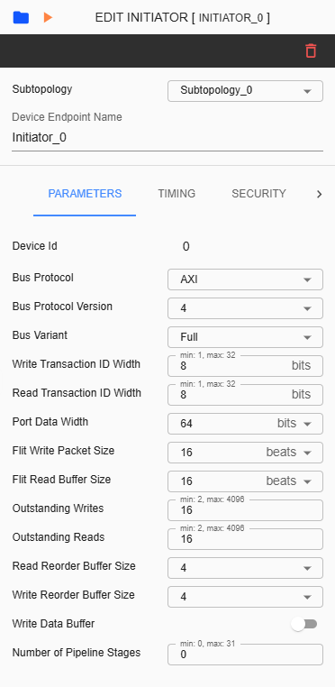
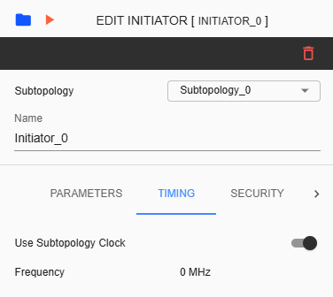
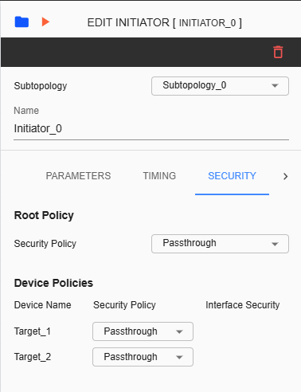
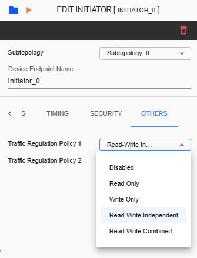

Initiator Configuration
====================================================

Configuring an Initiator device involves various settings. The Settings tab includes sections for Parameters, Timing, Security, and Others. The Timing section is available only if the 'Disable Frequency Validation' checkbox in the 'Create Project' settings is checked. The Traffic Behavior section is available only if the corresponding checkbox in the 'Create Project' settings is enabled. 

**Subtopology** – A dropdown list allows users to change the subtopology assigned to the selected initiator. This dropdown can be modified and reassigned to another available subtopology based on the topology configuration.
  
**Name** – Label name assigned for selected initiator. This is an input field where only alphanumeric keys and underscores are allowed.
  
**Device ID** – This identifier is unique for each component.
  
**Bus Protocol** – The selected item here will be assigned as the protocol for the Initiator device. The available selections are AXI, AHB, APB, and SIG_NATIVE.

**Bus Protocol Version** – The list of versions depends in ‘Bus Protocol’ that has been selected. Please check the table below as reference.

**Bus Variant** – The list of variants for the selected 'Bus Protocol' will be displayed here. Please check the table below as reference. 

**Write Transaction ID Width** – Refers to the number of bits allocated to identify write transactions. This parameter is displayed in all AXI devices except in AXI4-Lite.  

**Read Transaction ID Width** – Refers to the number of bits used to identify read transaction. This parameter is displayed in all AXI devices except in AXI4-Lite. 

**Port Data Width** – Refers to the Data Width you will be assigned to the connected port. Available list will depend on what Bus Protocol was selected. This is not displayed in SIG-NATIVE devices. Maximum possible value depends on the 'Data Width' set in System Configuration. 

**Flit Write Packet Size** – Amount of data in beats that constitutes a single flit for write transactions. 

**Flit Read Buffer Size** – Capacity of a buffer dedicated to storing incoming flits during read operations. 

**Outstanding Writes** – The number of allowed outstanding writes limited by the system’s architecture. 

**Outstanding Reads** – The number of allowed outstanding reads limited to help manage the bandwidth. 

**User Request Width** – This parameter is available in AHB or APB bus protocol. User can choose between 16 or 32 bits. 

**User Data Width** – This parameter is available in AHB or APB bus protocol. User can choose between 16 or 32 bits. 

**Read Reorder Buffer Size** – The number of read operations that can be stored and reordered. This parameter is displayed in all Bus Protocols except in SIG_NATIVE. 

**Write Reorder Buffer Size** – The number of write operations that can be stored and reordered. This parameter is displayed in all Bus Protocols except in SIG_NATIVE.

**Write Data Buffer** – This parameter allows the user to configure the Write Data Buffer for a selected Initiator device. Toggle on to enable and toggle off to disable. This parameter is displayed in all Bus Protocols excepts in SIG_NATIVE.

**Write Data Buffer Depth** – This parameter is an input field that defines the data buffer size for the selected device. Supported values range from 2 to 256. 

**Number of Pipeline Stages** - This parameter is for assigning Pipeline Stages in the selected initiator. 

+------------------+--------------------------+----------------------+
| **Bus Protocol** | **Bus Protocol Version** |    **Bus Variant**   |
+==================+==========================+======================+
|      AXI         |           3              |          N/A         |
+------------------+--------------------------+----------------------+
|                  |           4              |  Full, Lite, Stream  |
+------------------+--------------------------+----------------------+
|      AHB         |           3              |        Lite          |
+------------------+--------------------------+----------------------+
|                  |           5              |          N/A         |
+------------------+--------------------------+----------------------+
|      APB         |           3              |          N/A         |
+------------------+--------------------------+----------------------+
|                  |           5              |          N/A         |
+------------------+--------------------------+----------------------+
|    SIG_NATIVE    |          N/A             |          N/A         |
+------------------+--------------------------+----------------------+

Timing tab displays the Use Subtopology Clock and Frequency parameters. By default, Use Subtopology Clock is enabled, and the Frequency value follows the frequency set in the Subtopology folder.

**Use Subtopology Clock** – When enabled, the Frequency will be the same as the Subtopology clock. When disabled, the Frequency must be set in MHz.

**Frequency** – TThis refers to the speed at which a processor can execute instructions. By default, the value displayed here follows the value set in the Subtopology folder. This field can be modified if 'Use Subtopology Clock' is disabled. 

**Security Policy** – Policy or configuration of the top level for Initiator. Choose from Passthrough, Programmable, Blocked, and Fixed-Secure. 

**Interface Security** – When the selected security policy is ‘Programmable,’ the user must choose the interface security as either ‘Secure’ or ‘Non-Secure’.

**Device Policies** – Policy or configuration assigned for the connected Target device. This will also reflect in Target device’s setting. Choose from Passthrough, Programmable (Secure or Non-Secure), Blocked, and Fixed-Secure.

**Traffic Regulation Policy 1&2** – Dropdown item where user can choose between ‘Disabled’, ‘Read only’, ‘Write Only’, ‘Read-Write Independent’ or ‘Read-Write Combined’. 

**Traffic Regulation Policy 3** – Display-only parameter with a default value of ‘Disabled’. As of SWTOOLS_REL_5.1.1, this has not been implemented yet.

