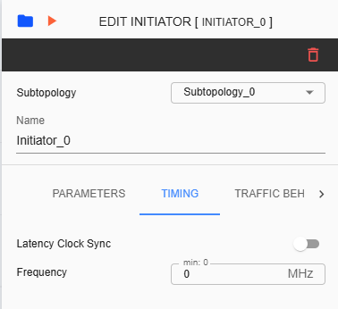
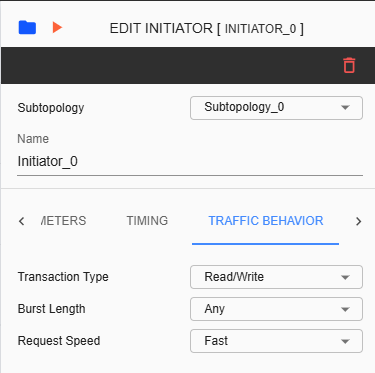
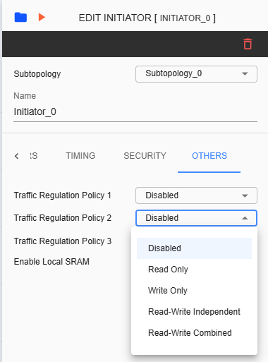
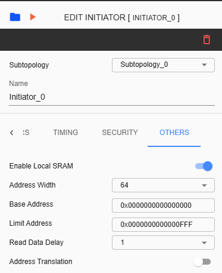

Initiator Configuration
====================================================

Configuring an Initiator device involves various settings. The Settings tab includes sections for Parameters, Timing, Traffic Behavior, Security, and Others. The Timing section is available only if the 'Disable Frequency Validation' checkbox in the 'Create Project' settings is checked. The Traffic Behavior section is available only if the corresponding checkbox in the 'Create Project' settings is enabled. 

**Subtopology** – A dropdown list for changing subtopology assigned for the selected initiator. 
  
**Name** – Label name assigned for selected initiator. This is an input field where only alphanumeric keys and underscores are allowed.
  
**Device ID** – This ID is unique for each component.
  
**Bus Protocol** – The selected item here will be assigned as the protocol for the Initiator device. The available selections are AXI, AHB, APB, and SIG_NATIVE.

**Bus Protocol Version** – The list of versions depends in ‘Bus Protocol’ that has been selected. Please check the table below as reference.

**Bus Variant** – The list of variants for the selected 'Bus Protocol' will be displayed here. Please check the table below as reference. 

**Write Transaction ID Width** – Refers to the number of bits allocated to identify write transactions. 

**Read Transaction ID Width** – Refers to the number of bits used to identify read transaction. 

**Port Data Width** – Refers to the Data Width you will be assigned to the connected port.  Available list will depend on what Bus Protocol was selected. 

**Flit Write Packet Size** – Amount of data in beats that constitutes a single flit for write transactions. 

**Flit Read Buffer Size** – Capacity of a buffer dedicated to storing incoming flits during read operations. 

**Outstanding Writes** – The number of allowed outstanding writes limited by the system’s architecture. 

**Outstanding Reads** – The number of allowed outstanding reads limited to help manage the bandwidth. 

**User Request Width** – This parameter is available in AHB or APB bus protocol. User can choose between 16 or 32 bits. 

**User Data Width** – This parameter is available in AHB or APB bus protocol. User can choose between 16 or 32 bits. 

**Read Reorder Buffer Size** – The number of read operations that can be stored and reordered. This parameter is displayed in all Bus Protocols except in SIG_NATIVE. 

**Write Reorder Buffer Size** – The number of write operations that can be stored and reordered. This parameter is displayed in all Bus Protocols except in SIG_NATIVE.

+------------------+--------------------------+----------------------+
| **Bus Protocol** | **Bus Protocol Version** |    **Bus Variant**   |
+==================+==========================+======================+
|      AXI         |           3              |          N/A         |
+------------------+--------------------------+----------------------+
|                  |           4              |  Full, Lite, Stream  |
+------------------+--------------------------+----------------------+
|      AHB         |           3              |        Lite          |
+------------------+--------------------------+----------------------+
|                  |           5              |          N/A         |
+------------------+--------------------------+----------------------+
|      APB         |           3              |          N/A         |
+------------------+--------------------------+----------------------+
|                  |           5              |          N/A         |
+------------------+--------------------------+----------------------+
|    SIG_NATIVE    |          N/A             |          N/A         |
+------------------+--------------------------+----------------------+

Timing tab will be displayed if the checkbox for ‘Disable Frequency Validation’ in the 'Create Project' prompt is unchecked. 

**Latency Clock Sync** – When enabled, Frequency will be same as Subtopology clock. When disabled, Frequency needs to be set in MHz. 

**Frequency** – The rate of speed on how a processor can execute instructions. This field will be available if ‘Latency Clock Sync’ is disabled. 

**Transaction Type** – This refers to the kind of operation or request being executed. The dropdown selections available are Write Only, Read Only, or Read/Write. 

**Burst Length** – This refers to the performance of data transfers. The dropdown selections available are Single, Short, Long, Max, or Any.

**Request Speed** – This refers to the measure of how quickly a system will initiate and handle requests. Selections are 'fast' or 'slow.'

.. image:: images/initiator-security.png
  :alt: initiator-security
  :align: center

**Security Policy** – Policy or configuration of the top level for Initiator. Choose from Passthrough, Programmable, Blocked, and Fixed-Secure. 

**Interface Security** – When the selected security policy is ‘Programmable,’ the user must choose the interface security as either ‘Secure’ or ‘Non-Secure’.

**Device Policies** – Policy or configuration assigned for the connected Target device. This will also reflect in Target device’s setting. Choose from Passthrough, Programmable (Secure or Non-Secure), Blocked, and Fixed-Secure.

**Traffic Regulation Policy 1&2** – Dropdown item where user can choose between ‘Disabled’, ‘Read only’, ‘Write Only’, ‘Read-Write Independent’ or ‘Read-Write Combined’. 

**Traffic Regulation Policy 3** – Display-only parameter with a default value of ‘Disabled’. As of SWTOOLS_REL_5.1.1, this has not been implemented yet.

**Enable Local SRAM** – This can be enabled if local SRAM is going to be used for the device. Default setting is disabled.

**Address Width** – Address Width for Local SRAM. User can choose from 8, 16, 32 and 64. 

**Base Address** – Starting address map for the Local SRAM when enabled. 

**Limit Address** – End address map for the Local SRAM when enabled. 

**Read Data Delay** – Time interval to set for a read request. User can choose either 1 or 2. 

**Address Translation** – Default settings is disabled. User can choose either true or false

