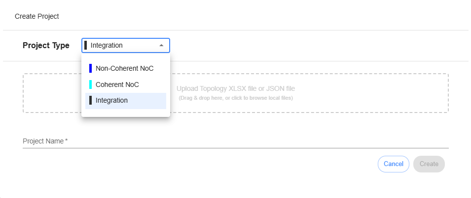
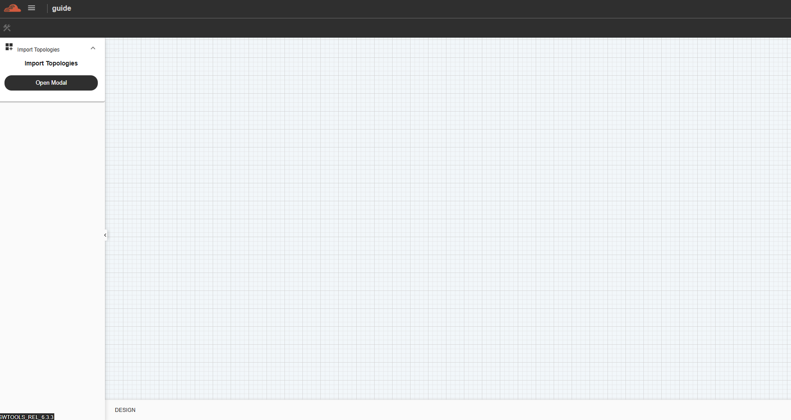
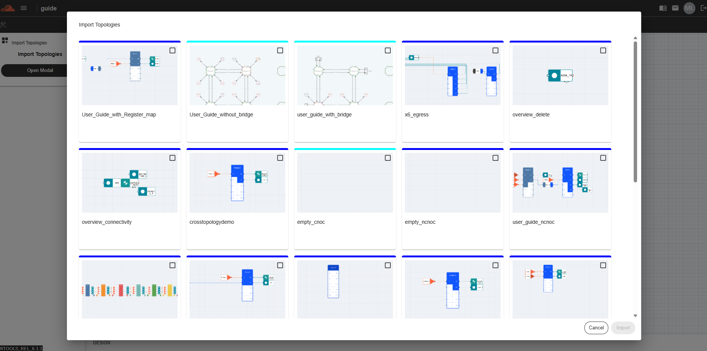

Integration Project 
---------------------------------

Integration Project is another type of project that users can create in Inoculator. It allows users to integrate Coherent NoC (C-NoC) and Non-Coherent NoC (NC-NoC) topologies into a single project.

To create an Integration Project, select Integration from the Project Type dropdown.

Open the Integration Project. A blank canvas will be displayed.

To add topologies, click the “Open Modal” button in the left panel. This will open a modal displaying all the Coherent NoC and Non-Coherent NoC projects available to the user. Select the project you want to integrate.

All selected topologies will be displayed on the canvas.

.. image:: images/integration_with_topologiess.png
   :alt: Integration with Topologies
   :align: center
   :width: 80%
