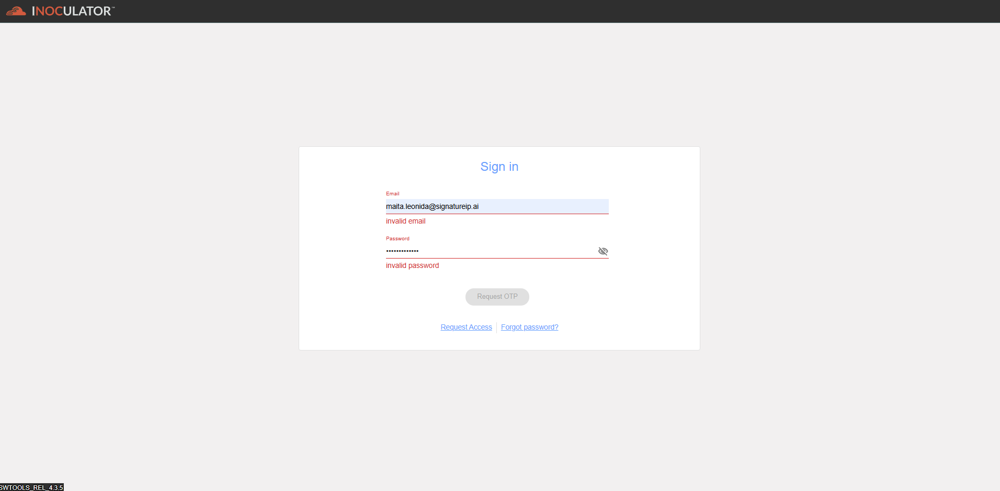

Authentication - Invalid Credentials
=======================================================

The system will try to authenticate the provided credentials (email address and password). Since the email address is invalid or does not match any existing account, the authentication will fail.

To resolve this issue, user can follow any of the following steps
  - Check the email address; check the typos, make sure that there are no spelling mistakes or extra spaces. 
  -	Make sure that account exists. Confirm that the email address is associated with a valid account in the system. 
  - Check the password; ensure that the password entered is correct and matches the one associated with the email address. 
  - Check the case sensitivity and ensure that there are no extra spaces. 
  - Use ‘Forgot Password’ link to reset the password.
  - Contact support
