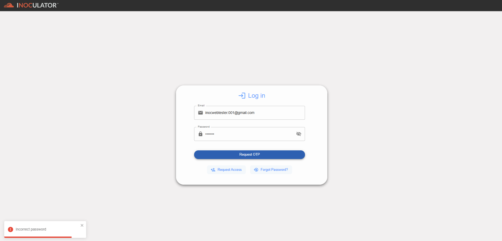

=======================================================
Handling Invalid Credentials Errors
=======================================================

During the portal login sequence, the security infrastructure strictly validates your submitted identity parameters. If the incoming email string or cryptographic password vector fails to match an active record inside the primary account registry, the system rejects the authentication request to safeguard the platform workspace.

--------------------------------------------------------------------------------

Authentication Failure Interface
====================================

When an authentication mismatch occurs, the login script halts execution, flushes the password buffer field, and generates a prominent error message banner directly on the access portal layout.

--------------------------------------------------------------------------------

Step-by-Step Login Troubleshooting Matrix
=============================================

If the interface flags your input as invalid, systematically work through the baseline system checks detailed in the matrix below:

.. list-table:: Credential Recovery Action Plan
   :widths: 30 70
   :header-rows: 1

   * - Evaluation Vectors
     - Recommended Diagnostic Steps & Self-Service Checks
   * - **Email String Audit**
     - Inspect the email text field closely for syntax anomalies. Verify there are no trailing whitespace blocks, accidental character typos, or localized spelling errors.
   * - **Account Status Verification**
     - Confirm that your profile onboarding sequence has fully completed. If you are a new collaborator, verify with your administrator that your profile record has been explicitly provisioned and activated.
   * - **Password Validation**
     - Retype your security key string carefully. Ensure your workstation keyboard is not executing unexpected character inputs or modifications.
   * - **Self-Service Reset Path**
     - If you cannot verify your current credential string, click the **Forgot Password** hyperlink located beneath the sign-in form to initialize an automated security link recovery handshake.

--------------------------------------------------------------------------------

Character Rules & Technical Considerations
==============================================

The authentication processing cluster interprets inbound character strings using strict parsing rules:

.. warning::
   **Crucial Input Parameters:**
   
   * **Case-Sensitivity Bounds:** Passwords are completely case-sensitive. Verify that your system's ``Caps Lock`` modifier is deactivated before typing your key string.
   * **Whitespace Characters:** The entry form treats spaces as unique characters. Ensure no hidden spaces are appended to the front or back of your email address string, especially when utilizing browser auto-fill or copy-paste clipboards.
   * **Administrative Hold Support:** If your structural inputs are perfectly accurate but login attempts continue to fail, your user container block may be undergoing an security review. For immediate resolution assistance, open a ticket with the **Signature IP Support Desk**.
