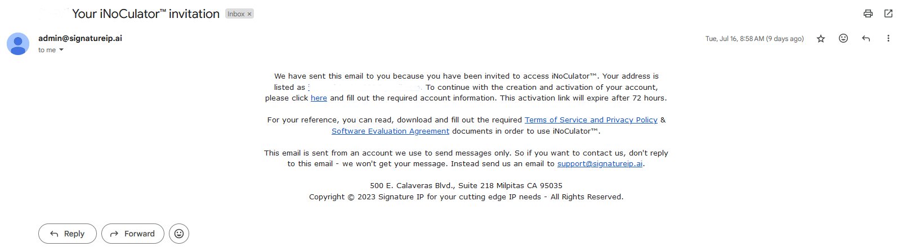

Invite User
===================================
This function is for Admin Account. Once access is requested, all admins of Inoculator will be notified, and the next step is to send an invitation to the requester to activate their account. This will be discussed on ‘Admin’s User Guide’. 
After an admin verifies the eligibility of the requester, admin will send an invite email to the requester. Request will receive this email content: 

The invitation includes links to the Terms of Service and Privacy Policy, and Software Evaluation Agreement for the requester to access and review. This email also includes the link for activation
