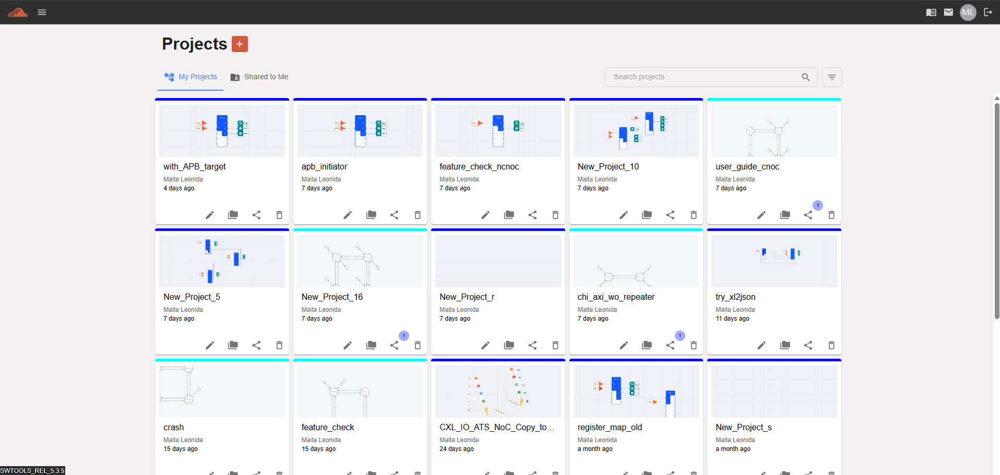

Logout 
===================================

After completing your tasks in iNoCulator, it is recommended to log out of your account to ensure data security.

To log out:

 1. Click the Logout icon located at the upper-right corner of the iNoCulator interface.

 2. A confirmation message will appear to verify your action.

 3. Select Yes to confirm and complete the logout process.

Once logged out, you will be redirected to the login screen.

1. 

2. 

.. image:: images/logout_confirmation_prompt.png
  :alt: logout_confirmation_prompt
  :align: center

3.

.. image:: images/ldashboard_page.png
  :alt: dashboard_page
  :align: center
