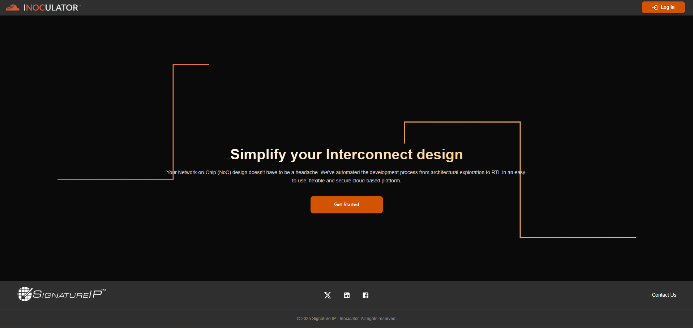

===================================
Session Termination and Logout
===================================

To maintain structural data integrity and satisfy corporate security compliance mandates, you should explicitly terminate your user session after concluding your design, verification, or simulation workflows on the platform canvas.

--------------------------------------------------------------------------------

Secure Logout Sequence
==========================

Follow this simple confirmation sequence to safely close your authenticated cloud workspace:

.. grid:: 1
   :gutter: 3

   .. grid-item-card:: Step 1: Trigger the Session Termination
      :class-header: bg-light font-weight-bold

      **Control Panel Action**
      
      Locate and click the **Logout** icon situated in the absolute upper-right corner of the global iNoCulator header navigation bar.
      
      .. image:: images/logout_icon_from_dashboard2.png
         :alt: Location of the secure Logout action icon on the global application toolbar
         :align: center
         :width: 85%

   .. grid-item-card:: Step 2: Confirm the De-Authentication Command
      :class-header: bg-light font-weight-bold

      **Security Intercept Modal**
      
      The application will overlay a confirmation prompt window to prevent accidental session loss. Click the **Yes** button to verify the instruction and initiate the token flush routine.
      
      .. image:: images/logout_confirmation_prompt.png
         :alt: Center overlay security modal window asking for logout confirmation
         :align: center
         :width: 65%

--------------------------------------------------------------------------------

Post-Termination Behavior
============================

Once you confirm the command, the central authentication layer invalidates your active session cookies, flushes local memory cache allocations, and drops your active security token block.

The application engine immediately shifts your browser view back to the primary **Sign In** landing interface. This automatic routing verification confirms that your connection has closed successfully and your cloud design workspace is safely locked against unauthenticated access.

