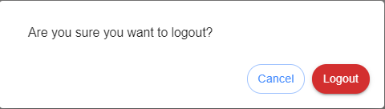

Logout 
===================================

After using iNoCulator, the user will log out of their account. To do this, the user must click the 'Logout' icon located in the upper right corner of the tool. A confirmation message will appear before the logout is successful.

.. image:: images/logout_icon_from_dashboard.png
  :alt: logout_icon_from_dashboard
  :align: center

