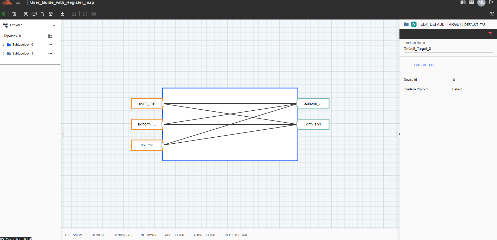
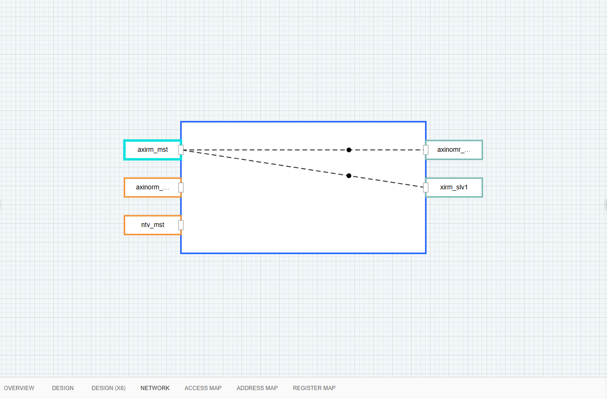

NC-NoC Network View Tab
================================

The Network tab provides a graphical canvas view of your system topology, allowing you to inspect and configure network blocks and device interconnections.

**Explorer Panel (Left):** Navigate through your project's hierarchical structure, including topologies and sub-topologies

**Canvas View (Center):** Visualize the interconnect block diagram showing routing pathways between master/initiator nodes (e.g., axirm_mst, axinorm_..., ntv_mst) on the left and target/slave nodes (e.g., axinomr_..., xirm_slv1) on the right.

**Properties Panel (Right):** Select any component on the canvas to view and edit its parameters, such as Interface Name, Device Id, and Interface Protocol.

To view the connections, click any device to display its network flow.

