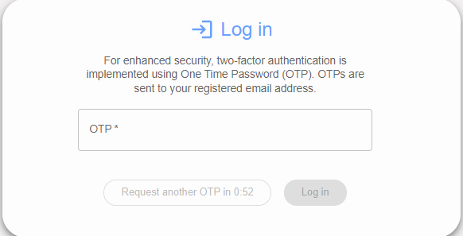
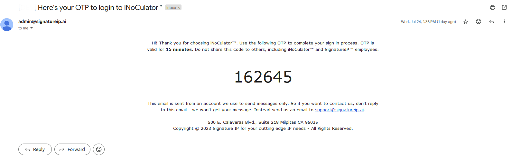

One-Time-Pin (OTP)
===================================

TTo use iNoCulator, the user must enter valid credentials and input a valid OTP. The one-time PIN will be sent to the user's registered email.

