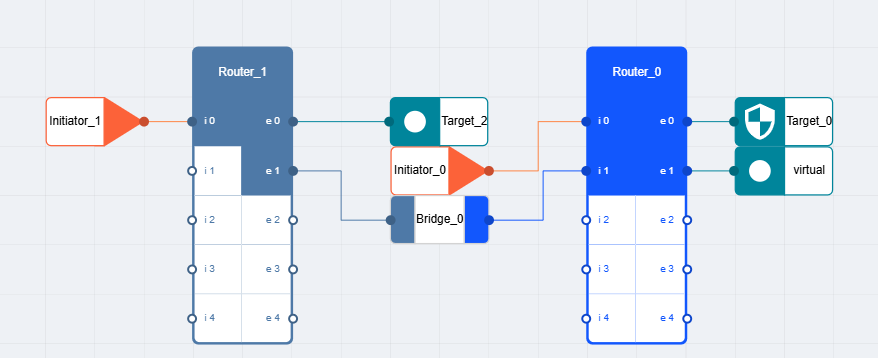
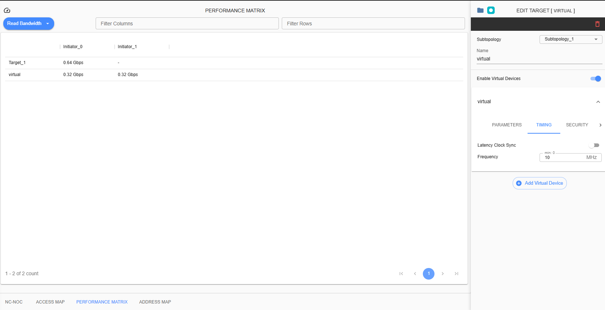

Performance Matrix
=========================================

This feature is for viewing the performance of devices designed in the project. This has four categorizations of table: Read Bandwidth, Write Bandwidth, Read Latency and Write Latency. This can be access by selecting the “Performance Matrix” tab. 
    1. Read Bandwidth

The matrix shows the estimated data transfer rate used per connecting ingress to egress. 
Estimated computation for Bandwidth is

(<Port Data Width> * <Frequency>) / 1000

Example: 

Subtopology Port Data Width – 32

Frequency – 10 MHz

(32 * 10MHz) / 1000 = 0.32Gbps

    2. Write Bandwidth 

The matrix shows the estimated data transfer rate used per connecting ingress to egress. 

Estimated computation for Bandwidth is

(<Port Data Width> * <Frequency>) / 1000

Example: 

Port Data Width – 32

Frequency – 10 MHz

(32 * 10MHz) / 1000= 0.32 Gbps

