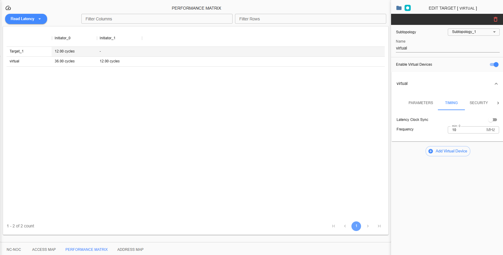

Performance Matrix
=========================================
**Note: Starting from SWTOOLS_REL_5.1.1, the ‘Performance Matrix’ tab will be hidden for certain reasons. If a group needs this function, please contact support or the SignatureIP admin to request this feature.**

This feature is for viewing the performance of devices designed in the project. This has four categorizations of table: Read Bandwidth, Write Bandwidth, Read Latency and Write Latency. This can be access by selecting the “Performance Matrix” tab. 

    1. Read Bandwidth

.. image:: images/sample_topology_with_bridge3.png
  :alt: sample_topology_with_bridge3
  :align: center

The matrix shows the estimated data transfer rate used per connecting ingress to egress. 
Estimated computation for Bandwidth is

(<Port Data Width> * <Frequency>) / 1000

Example: 

Subtopology Port Data Width – 32

Frequency – 10 MHz

(32 * 10MHz) / 1000 = 0.32Gbps

    2. Write Bandwidth 

.. image:: images/performance_matrix-write_bandwidth.png
  :alt: performance_matrix-write_bandwidth
  :align: center

The matrix shows the estimated data transfer rate used per connecting ingress to egress. 

Estimated computation for Bandwidth is

(<Port Data Width> * <Frequency>) / 1000

Example: 

Port Data Width – 32

Frequency – 10 MHz

(32 * 10MHz) / 1000= 0.32 Gbps

    3. Read Latency

The matrix shows the estimated number of cycles it takes for a router to process and respond to incoming data requests.

Estimated computation is:

12 cycles each connection * number of routers that connection will passthrough

Example: 

Number of routers – 1

12 * 1 routers = 12.00 cycles

    4. Write Latency

The matrix shows the estimated number of cycles it refers to the time it takes for the router to process outgoing data 

and send it onto the network.

Estimated computation is:

12 cycles each connection * number of routers that connection will passthrough

Example: 

Number of routers – 1

12 * 1 routers = 12.00 cycles

