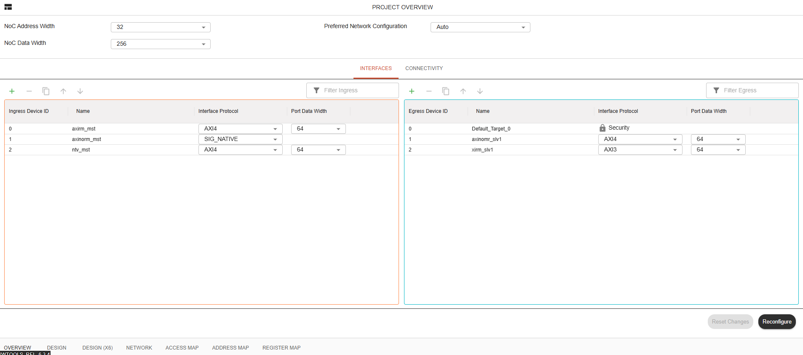
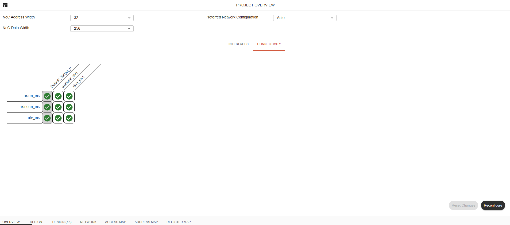

NC-NoC Project Overview
====================================================

The Project Overview (specifically the Interfaces tab) allows you to configure global network settings and manage device communication interfaces.

Interface Tab
------------------

**Global Network Settings:** Define top-level parameters such as NoC Address Width, NoC Data Width, and the Preferred Network Configuration

**Ingress Devices (Left Panel):** Configure incoming data sources by assigning Ingress Device IDs, names, Interface Protocols (e.g., AXI4, SIG_NATIVE), and Port Data Widths.

**Egress Devices (Right Panel):** Manage outgoing destinations by specifying Egress Device IDs, target names, security settings, and communication protocols (e.g., AXI4, AXI3) with corresponding port widths.

**Actions:** Use the toolbar buttons to add or remove interfaces, filter lists, and apply changes using the Reconfigure or Reset Changes options at the bottom.

Connectivty Tab
-----------------------

**Matrix View:** Visualize and manage communication pathways between all configured ingress devices (rows) and egress targets (columns).

**Connection Toggle:** Use the interactive checkmark grid to enable or disable routing paths between specific initiators (e.g., axinorm_mst, axirm_mst) and targets (e.g., Default_Target_0, axirm_slv1, axinorm_slv2).

**Global & Action Controls:** Maintain access to the top-level NoC Address Width, NoC Data Width, and Preferred Network Configuration settings, with final layout updates applied via the Reconfigure button.

