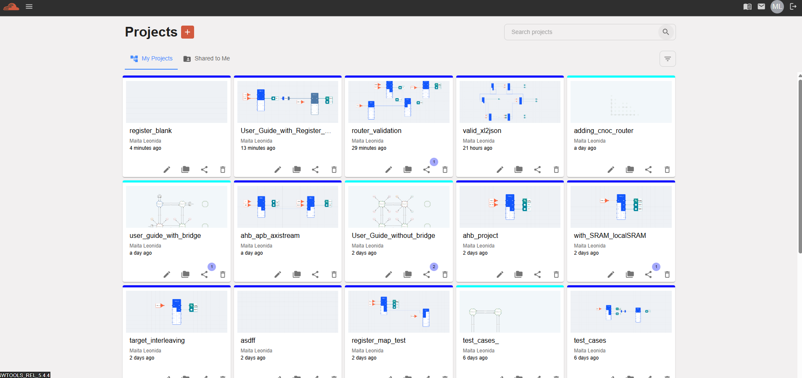
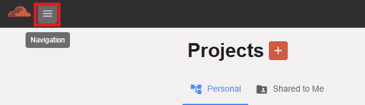
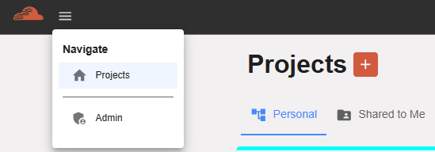
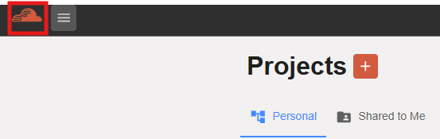
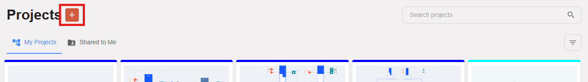
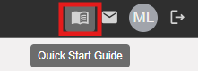
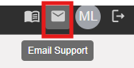
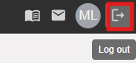
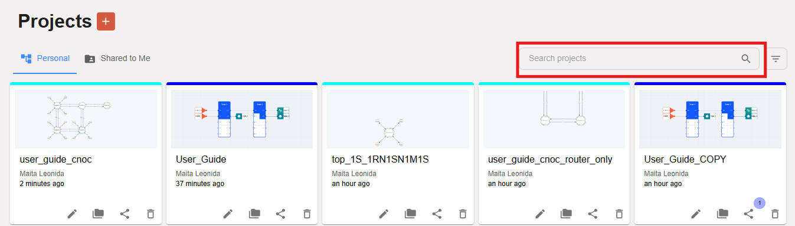
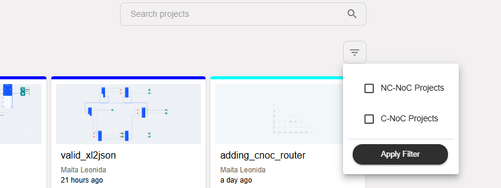

Project Page
=============================

This section describes the Project Page of the Inoculator Web, including its UI layout and UX flow.

Below are the key components and features available on the Project Page:

  - Project list and navigation

  - Search and filter functions

  - Project creation and management actions

  - Tooltip messages for icons and buttons

  - Access to project details and configuration

**Project Page Overview**

The Project Page displays all available projects and provides tools for creating, managing, and navigating projects.

**Hamburger Menu** 

The Hamburger Menu (☰) expands to show additional navigation options and settings.

**Navigation** 

The Navigation bar provides quick access to key pages and features of the application.

**Inoculator Icon** 

The Home Icon or Inoculator Icon takes you back to the main landing page of the application.

**Create Project Button** 

Click the Create Project button to start a new project and configure its details.

**Quick Start Guide** 

The Quick Start Guide provides step-by-step instructions for new users to quickly learn the tool.

**Email Support** 

The Email Support option allows users to contact the support team for assistance.

**Logout Button** 

The Log Out button securely signs the user out of the application.

**Search Project** 

Use the Search Field to quickly find a project by entering its name or keyword.

**Filter Project** 

The Filter Button allows users to refine the project list based on categories or attributes.

