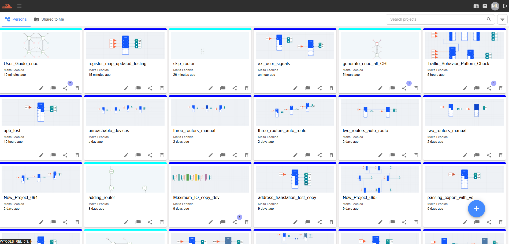
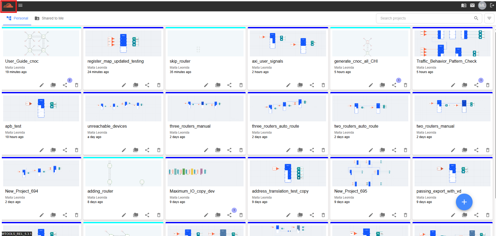
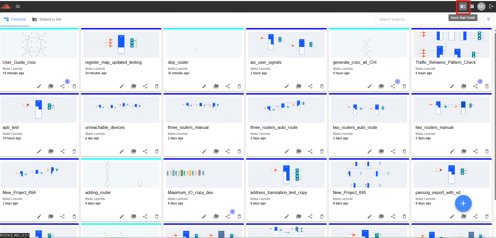
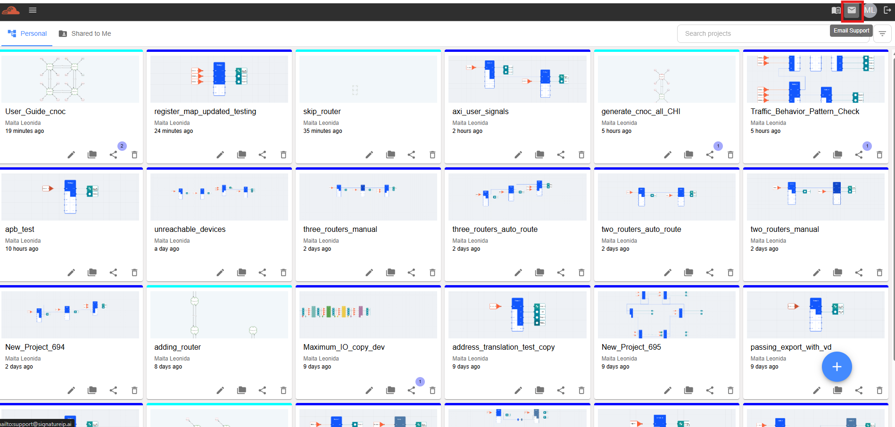
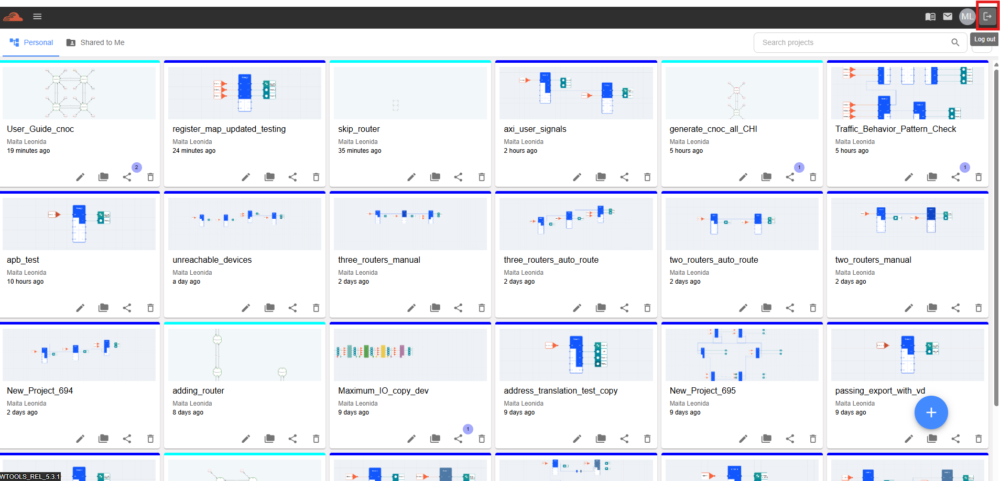

Project Page
=============================

This section describes the Project Page of the Inoculator Web, including its UI layout and UX flow.

Below are the key components and features available on the Project Page:

  - Project list and navigation

  - Search and filter functions

  - Project creation and management actions

  - Tooltip messages for icons and buttons

  - Access to project details and configuration

**Project Page Overview**

**Hamburger Menu** 

**Navigation** 

**Inoculator Icon** 

**Create Project Button** 

**Quick Start Guide** 

**Email Support** 

**Logout Button** 

**Search Project** 

**Filter Project** 

