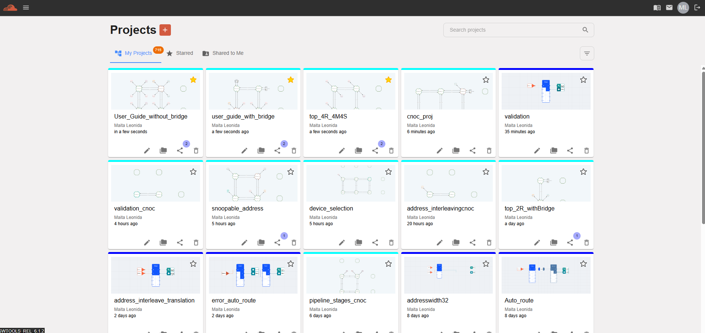

=======================================================
Project Management Hub & Dashboard Interface
=======================================================

The **Project Page** serves as the central control plane for iNoCulator Web. This workspace aggregates your Network-on-Chip (NoC) design variants, providing high-velocity lifecycle tooling to initialize, index, filter, and audit active architectural canvases.

--------------------------------------------------------------------------------

Core Dashboard Features
===========================

The control hub unifies configuration management and profile navigation layers through the following primary interface primitives:

* **Global Navigation & Canvas List:** Direct entry vectors to navigate workspace partitions and cross-link architectural topologies.
* **Granular Search & Attribute Filters:** Real-time query execution engines to isolate historical design instances across large-scale enterprise directories.
* **On-Demand Lifecycle Actions:** Single-click canvas instantiations paired with contextual hover states (tooltips) for error-free execution.
* **Dynamic Analytics Badge:** A real-time numerical counter indicator displaying your current global project seat allocation and resource footprint.

--------------------------------------------------------------------------------

Global Control Toolbar & Workspace Navigation
=================================================

.. grid:: 2
   :gutter: 3

   .. grid-item-card:: ☰ Global Navigation Drawer
      :class-header: bg-light font-weight-bold

      The **Hamburger Menu** collapses the primary viewport margins, expanding a dedicated lateral drawer containing system adjustments and platform setting configurations.
      
      .. image:: images/projects_page-hamburger_menu3.png
         :alt: Expanded sidebar navigation drawer menu showing workspace settings
         :align: center
         :width: 85%

   .. grid-item-card:: 🧭 Application Toolbar
      :class-header: bg-light font-weight-bold

      The top-level **Navigation Bar** maintains persistence across screens, granting instantaneous shortcut jumps to active validation suites and compiler pipelines.
      
      .. image:: images/projects_page-navigation3.png
         :alt: Top application navigation banner tracking macro-level user location
         :align: center
         :width: 85%

   .. grid-item-card:: 🚀 Root Domain Shortcut
      :class-header: bg-light font-weight-bold

      Clicking the specialized **iNoCulator Icon** acts as an instant home anchor, flushing non-committed navigation histories and returning the client view to the root landing interface.
      
      .. image:: images/projects_page-home3.png
         :alt: Application logo vector functioning as a homepage redirection anchor
         :align: center
         :width: 50%

   .. grid-item-card:: ✨ Starred & Favorite Canvases
      :class-header: bg-light font-weight-bold

      The **Starred Projects Filter Tab** allows architecture teams to pin prioritized top-level layouts, skipping general search streams to access critical variants.
      
      .. image:: images/projects_page-starred_project.png
         :alt: Filter layout showcasing a localized view of favorited design suites
         :align: center
         :width: 75%

--------------------------------------------------------------------------------

Project Creation & Resource Indexing
========================================

.. list-table:: Management & Search Infrastructure Matrix
   :widths: 35 65
   :header-rows: 1

   * - Control Component
     - Functional Behavior & Operations
   * - **Add New Project Canvas**
     - Triggers the system instantiation modal window. Initializes a blank slate entry layer to specify core clock domains, address bounds, and routing structures.
     
       .. image:: images/projects_page-add_new_project.png
          :alt: Action button initializing a fresh Network-on-Chip design workspace
          :align: center
          :width: 70%
   * - **Real-Time String Search**
     - Executes a progressive query against the global project registry. Filters the data view on the fly based on project names, creator IDs, or target SOC tags.
     
       .. image:: images/search_project_page5.png
          :alt: Text entry search control component isolating active records
          :align: center
          :width: 70%
   * - **Attribute Filter Sub-System**
     - Refines long lists by applying boolean categorical boundaries (e.g., topology layout type, date modified thresholds, or compilation status metrics).
     
       .. image:: images/filter_function4.png
          :alt: Categorical dropdown filtering mechanics sorting workspace attributes
          :align: center
          :width: 70%

--------------------------------------------------------------------------------

Help Desk Utility & Session Termination
=============================================

The global dashboard footer and peripheral drop panels group utility hooks to optimize designer onboarding paths and guarantee secure session boundaries:

.. list-table:: Support Utilities
   :widths: 25 75
   :stub-columns: 1

   * - Quick Start Guide
     - Launches an interactive, step-by-step product walkthrough that introduces network primitives and validation procedures directly within the UI layout canvas.
     
       .. image:: images/projects_page-quick_start_guide2.png
          :alt: Onboarding documentation wizard vector
          :align: center
          :width: 40%
   * - Email Support
     - Formulates an encrypted support transmission wrapper containing client telemetry logs, directly targeting the **Signature IP Enterprise Help Desk** pipeline.
     
       .. image:: images/projects_page-email_support2.png
          :alt: Help desk support link trigger
          :align: center
          :width: 40%
   * - Logout Routine
     - Invalidates active web-tokens, drops state records, and securely routes the client back to the root sign-in interface window.
     
       .. image:: images/projects_page-logut_button2.png
          :alt: Secure application sign-out interface trigger
          :align: center
          :width: 40%
