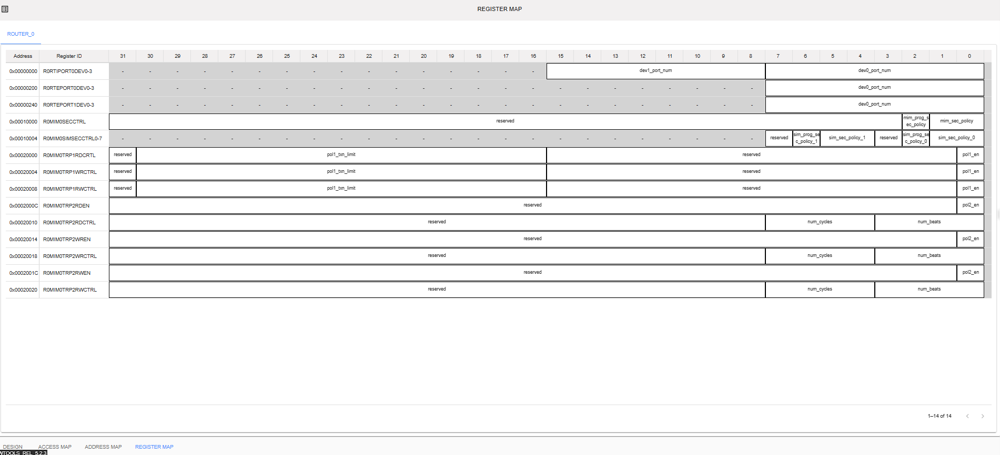

Register Map
=========================================================================

The Register Map is a list of all the registers (settings or control points) inside a hardware component or chip. It helps engineers and developers understand how to communicate with the hardware. Each register usually shows its address, Register ID/name, how it can be accessed (like Read or Write), its default value, and details about each bit it contains.

In the semiconductor industry, the Register Map acts like a guide between the software and hardware. It lets users configure, control, check status, and troubleshoot different features of the chip, like power settings, clock signals, and input/output behavior.

Key Features of the Register Map

- Address Offsets: Each register is mapped to a specific memory address.

- Access Types: Indicates if the register is Read-only (RO), Write-only (WO), Read/Write (RW), or Read-Clear (RC).

- Bit-field Details: Provides field-level control and status information with descriptions for each bit or group of bits.

- Reset/Default Values: Indicates the initial value after power-up or reset.

- Usage Context: Specifies functional groupings or relevant modules where the registers apply.

To view the Register Map, toggle on the 'Register Map Generation' from NC-NoC System Config. Register Map tab should be visible inside the NC-NoC Project. 

The behavior of the Register Map table will be affected by the following factors:

1. Traffic Regulation Policy of Initiator Device 
2. Virtual devices 
3. Router, Initiator and Target Device

