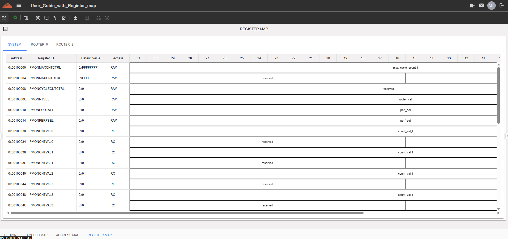
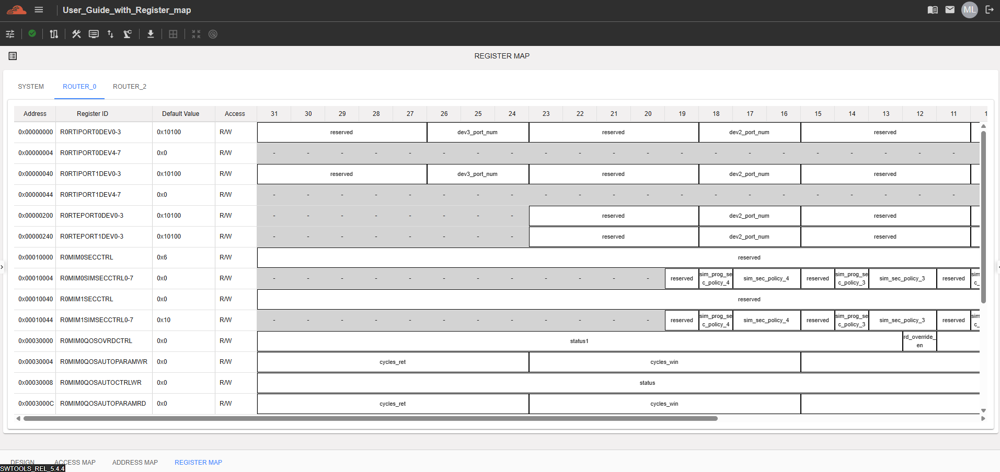
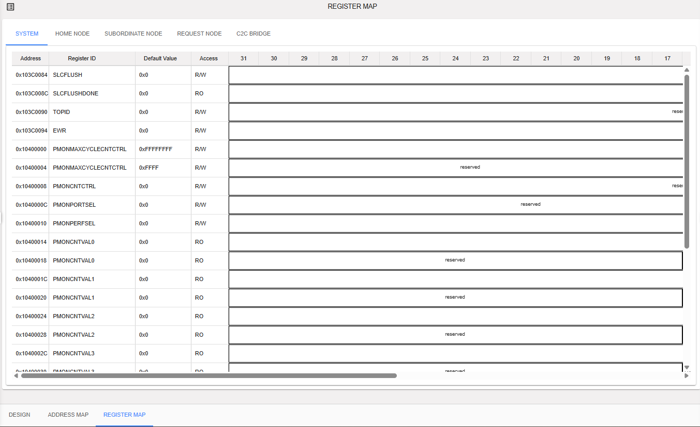
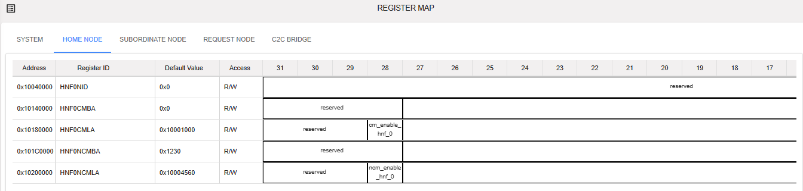
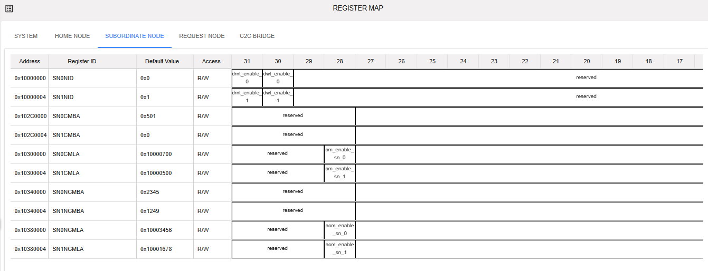
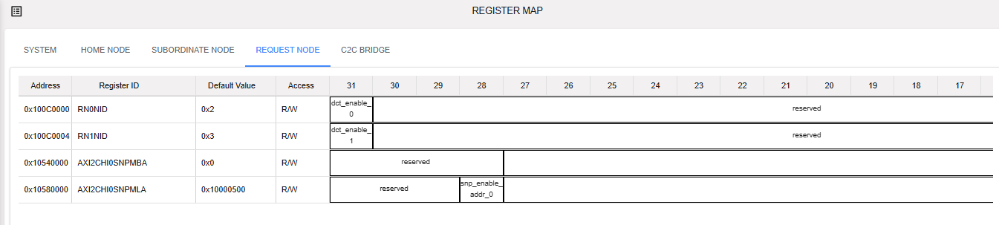
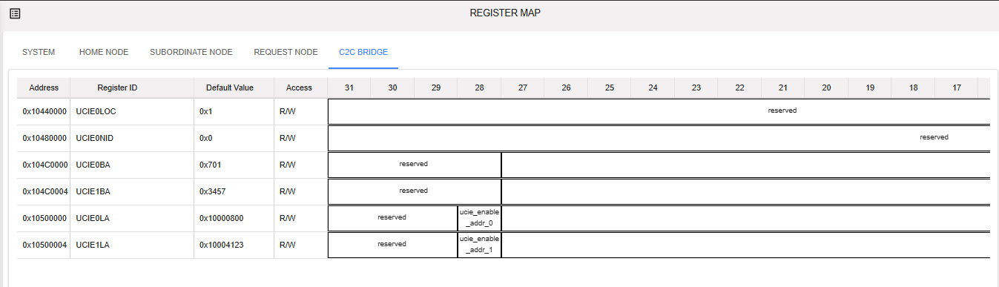

Register Map
=========================================================================

NC-NoC
~~~~~~~~~~~~~~~~~~~~~~~~~~~~~~~~~~~~~~~~~~~~~~~

The Register Map is a list of all the registers (settings or control points) inside a hardware component or chip. It helps engineers and developers understand how to communicate with the hardware. Each register usually shows its address, Register ID/name, how it can be accessed (like Read or Write), its default value, and details about each bit it contains.

In the semiconductor industry, the Register Map acts like a guide between the software and hardware. It lets users configure, control, check status, and troubleshoot different features of the chip, like power settings, clock signals, and input/output behavior.

Key Features of the Register Map

- Address Offsets: Each register is mapped to a specific memory address.

- Access Types: Indicates if the register is Read-only (RO), Write-only (WO), Read/Write (RW), or Read-Clear (RC).

- Bit-field Details: Provides field-level control and status information with descriptions for each bit or group of bits.

- Reset/Default Values: Indicates the initial value after power-up or reset.

- Usage Context: Specifies functional groupings or relevant modules where the registers apply.

To view the Register Map, toggle on the 'Register Map Generation' from NC-NoC System Config. Register Map tab should be visible inside the NC-NoC Project. 

Table display information contains:

+-----------------+-----------------------------------------------------------------------+
| **Column**      | **Description**                                                       |
+-----------------+-----------------------------------------------------------------------+
| Register ID     | Logical Name of Register                                              |
+-----------------+-----------------------------------------------------------------------+
| Address         | Register Address relative to base                                     |
+-----------------+-----------------------------------------------------------------------+
| Default Value   | Reset Value of the field                                              |
+-----------------+-----------------------------------------------------------------------+
| Access Type     | RO, WO, R/W etc.,                                                     |
+-----------------+-----------------------------------------------------------------------+
| Bit Range       | Bit position                                                          |
+-----------------+-----------------------------------------------------------------------+

**Target vs Initiator Registers**

Some registers are grouped as:

  - Target-related registers – Used when the block operates as a target

  - Initiator-related registers – Used when the block operates as an initiator

These groups are displayed only when the corresponding mode is enabled or applicable.

**Conditional Registers**

Some fields or registers are displayed only if certain features are enabled, such as:

  - Optional IP features

  - Configuration parameters

  - Compile-time or fuse-based options

These conditions are usually described in the Remarks or Description columns.

The behavior of the Register Map table will be affected by the following factors:

1. Traffic Regulation Policy of Initiator Device 
2. Virtual devices 
3. Count of Router, Initiator and Target Device on the grid
4. Access Map or Root Policy of each device
5. Address Interleaving

C-NoC
~~~~~~~~~~~~~~~~~~~~~~~~~~~~~~~~~~~~~~~~~~~~~~~~~~~~~~~~~~~~~~~~~~~~~~~~~~~~~~~~~

The C-NoC Register Map provides a structured view of all registers used in the C-NoC (Configurable Network-on-Chip) system. It allows users to view, configure, and validate register settings for system setup, debugging, and validation.

Structured Register View

  - Displays all registers in an organized hierarchy (by module/block)

  - Groups related registers for easier navigation

To view the Register Map, toggle on the 'Register Map Generation' from C-NoC System Config. Register Map tab should be visible inside the C-NoC Project. 

**System tab** - This will display the registers for Performance Monitor, Recovery and QOS Control, and System Control.

**Home Node** - Registers that define and control the primary (home) node responsible for managing and coordinating system-level operations and data ownership within the network.

**Subordinate Node** - Registers used to configure and monitor secondary nodes that operate under the home node, handling delegated tasks and supporting system scalability.

**Request Node** - Registers that manage transaction or access requests initiated by nodes, including routing, tracking, and arbitration of requests within the system.

**C2C Bridge** - Registers that control and configure the Chip-to-Chip (C2C) bridge interface, enabling communication and data transfer between two separate chips or subsystems.

