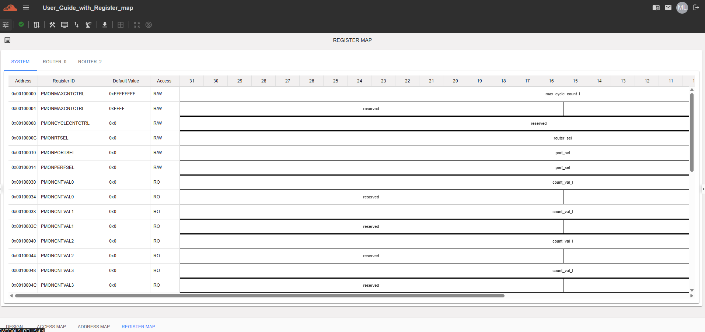
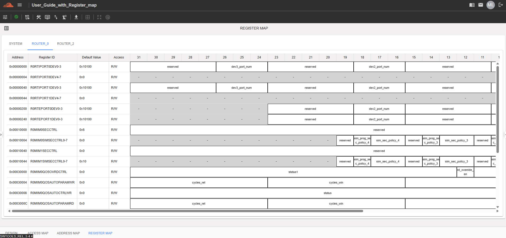

=========================================================
Register Map - Non-Coherent NoC (NC-NoC)
=========================================================

The **Register Map** functions as the definitive hardware-software interface (HSI) specification for the Non-Coherent Network-on-Chip (NC-NoC) fabric workspace. It itemizes the software-accessible control, status, and configuration registers embedded within the NoC sub-systems, giving firmware developers and system architects a clear roadmap to program and orchestrate the underlying silicon.

--------------------------------------------------------------------------------

🔩 Architectural Significance & Attributes
=============================================

In modern system-on-chip (SoC) integration workflows, the Register Map acts as a programmatic bridge. It exposes runtime levers to dynamically adjust power profiles, throttle clock domains, audit performance counters, and isolate transport errors across the switch fabric.

**Core Technical Attributes:**

* **Address Offsets:** Relative memory-mapped offsets calculated directly against the block's base address pointer.
* **Access Directives:** Explicit permissions identifying fields as Read-Only (RO), Write-Only (WO), Read/Write (RW), or Read-to-Clear (RC).
* **Bit-Field Detail Vectors:** Granular, bit-level masking boundaries establishing field limits and slice behavior profiles.
* **Reset/Default States:** Deterministic register values loaded into the flip-flop arrays immediately following an un-reset or cold power-up cycle.

--------------------------------------------------------------------------------

⚙️ Activating Register Map Generation
=======================================

To compile, view, and export the register map structure for your current NC-NoC design instance, fulfill the following configuration requirements:

1. Open your active **NC-NoC System Configuration** workspace panel.
2. Toggle the **Register Map Generation** property field to an active state.
3. Access the dynamically compiled layout from the newly instantiated **Register Map** project tab.

--------------------------------------------------------------------------------

📋 UI Layout & Data Column Schema
===================================

The Register Map explorer grid formats structural data inside a scannable table matrix. The standard interface includes the following tracking columns:

Register ID
   The unique, human-readable logical identifier or mnemonic code assigned to the hardware register (e.g., ``NI_CTRL_REG0``).

Address
   The exact hexadecimal memory offset relative to the block's assigned peripheral base address location.

Default Value
   The initialized, hardwired hardware state loaded on the release of a global master reset signal line.

Access Type
   The hardcoded hardware security permissions boundary regulating read/write cycles (RO, WO, R/W, RC).

Bit Range
   The specific bit position slice (e.g., ``[31:0]`` or ``[15:8]``) targeted by the sub-field property string.

--------------------------------------------------------------------------------

🎭 Behavioral Logic & Topology Variances
=========================================

.. grid:: 2
   :gutter: 3

   .. grid-item-card:: Target vs. Initiator Slices
      :class-header: bg-light font-weight-bold

      The interface filters software-facing registers depending on the functional operating mode of the endpoint instance:
      
      * **Target-Related Slices:** Displayed solely when the peripheral block functions as an address target interface node.
      * **Initiator-Related Slices:** Injected into the table layout only when the underlying node executes master transactions across the grid.

   .. grid-item-card:: Conditional Register Triggers
      :class-header: bg-light font-weight-bold

      To minimize configuration bloat, specific bit-fields or whole address zones alter their layout visibility dynamically based on your compile-time flags:
      
      * Optional IP subsystem attachments.
      * Hardware parameter overrides.
      * Fuse-blown options or static hardware straps.

--------------------------------------------------------------------------------

⚠️ Upstream Factors Distorting the Register Layout
===================================================

.. warning::
   The final generated row count, base addressing intervals, and field offsets are directly affected by upstream network architecture decisions. Changes to the following parameters will trigger an automated redraw and recalculation of your map parameters:

* **Initiator Traffic Regulation:** Injection rate-limiting and bandwidth allocation limits add performance counter tracking registers.
* **Virtualization Topologies:** Incorporating virtual devices replicates target memory space parameters across separate software layers.
* **Grid Component Density:** The total instance count of routers, initiators, and targets scales the master address offset map linearly.
* **Access Control Lists (ACLs):** Local device root policies restrict or permit visibility of specific address slices based on endpoint privileges.
* **Address Interleaving Patterns:** Stripping address segments across memory boundaries changes how consecutive base indices appear inside your map.
