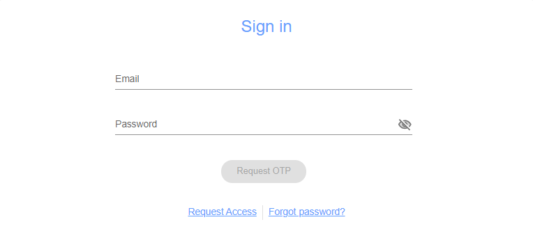
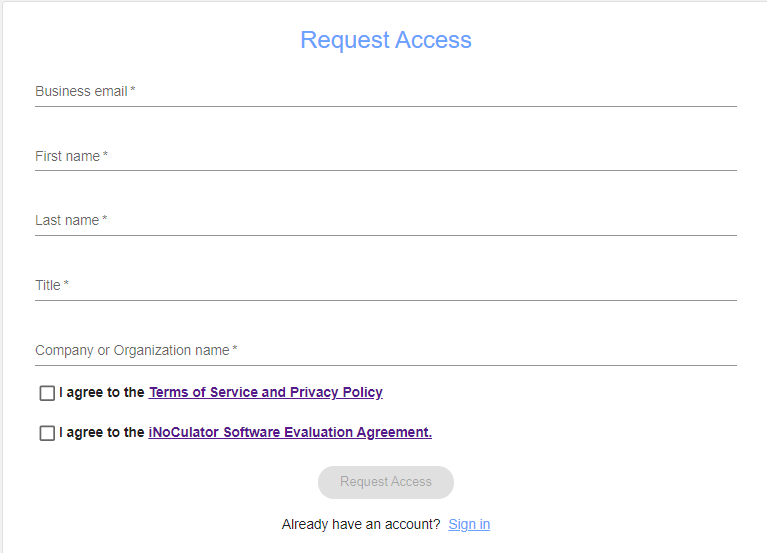
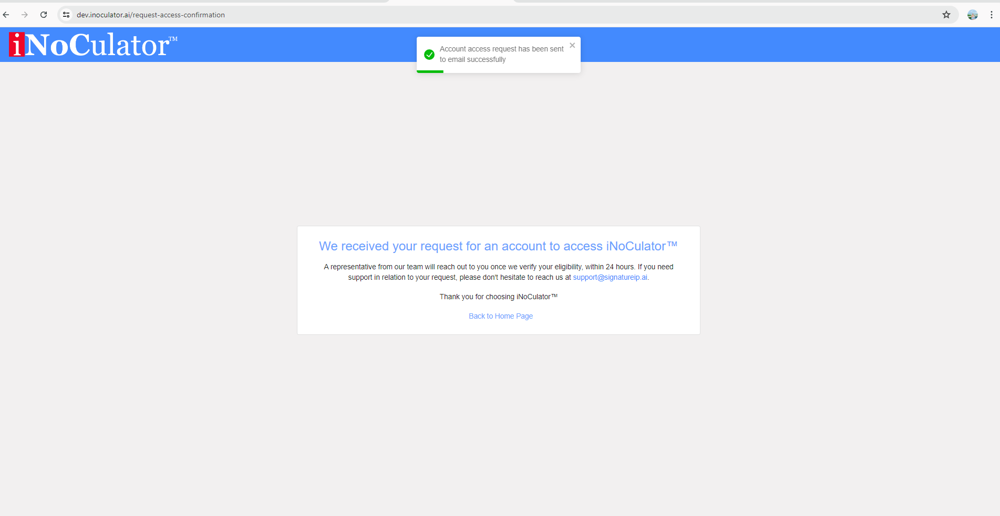

Request Access
===================================
This function is a formal process for users to request permission or authorization to
access the iNoCulator. To find this, from home page, click ‘Get started now!’ button. 

.. image:: images/request_access-home_page.png
    :alt: request_access-home_page
    :align: center

---------------------------------------------------------------------------------------

Limitations:
    - Upper case only on the first letters. (first name and last name)
    - Email should be business email and includes @domainname.
    - Use only alphanumeric keys including ñ and Ñ, spaces and no special characters.

    After filling out the Request Access Form, confirmation page will be displayed and user’s
registered email will receive a confirmation email from Admin that the request has been sent
successfully.

.. image:: images/request_access-confirmation_message.png
    :alt: request_access-confirmation_message
    :align: center
