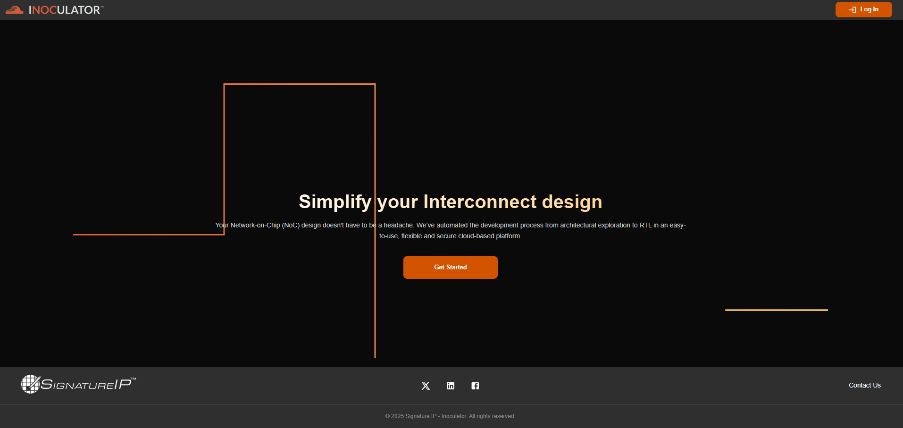
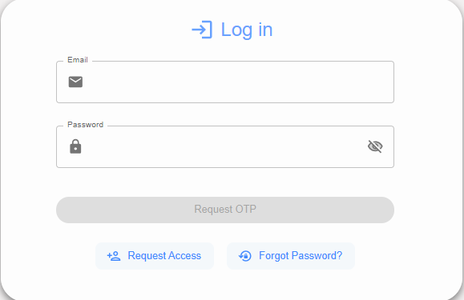
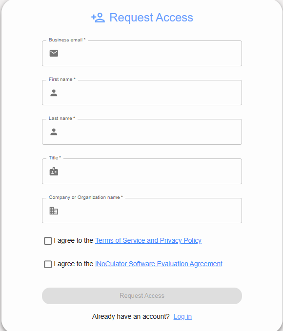
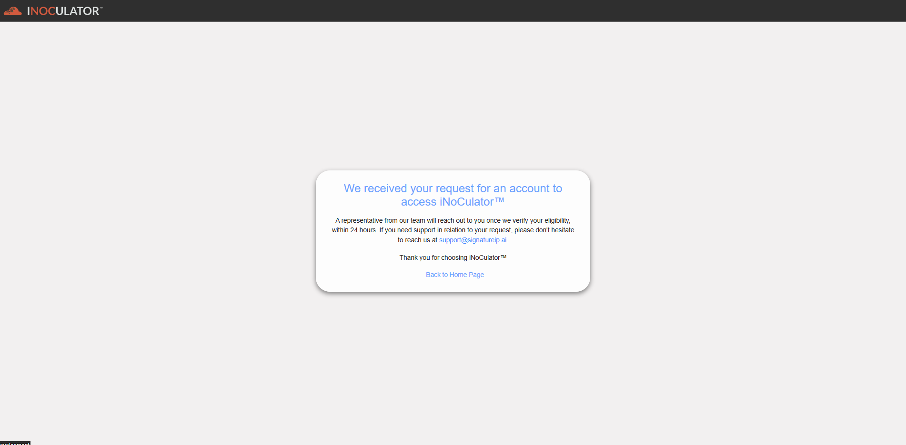
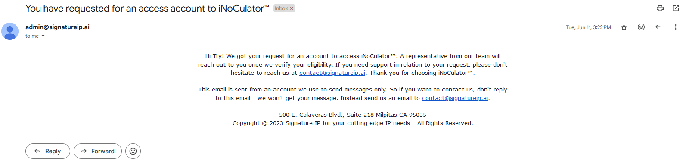

Request Access
===================================
This function is a formal process for users to request permission or authorization to
access the iNoCulator. 

1. From the Home page, click the "Get Started" button to begin using the tool.

2. You can also find the "Request Access" button on the Log In page to submit an access request for the tool.

3. This is the Request Access form. Fill out all required fields to request access to the Inoculator Web.

---------------------------------------------------------------------------------------

Limitations:
    - Upper case only on the first letters. (first name and last name)
    - Email should be business email and includes @domainname.
    - Use only alphanumeric keys including ñ and Ñ, spaces and no special characters.

After filling out the Request Access Form, a confirmation page will be displayed, and the user's registered email will receive a confirmation email from the admin indicating that the request has been sent successfully. 

1. After submission, a confirmation page will appear indicating that your request has been sent to the Administrators for review.

2. A confirmation email will be sent to you, indicating that your request has been successfully sent to the Administrators for review.

