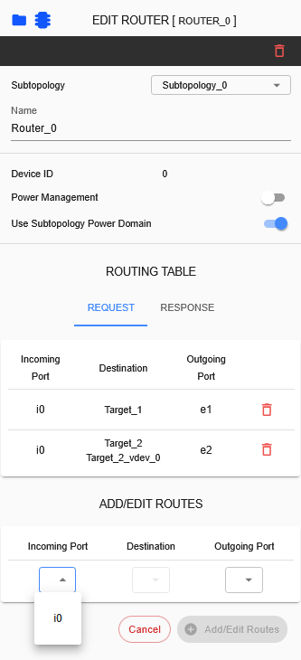

Router Configuration 
=============================================

Configuring a router includes setting up the power and routing table. To start editing the router settings, the user must click on the router in the grid.

**Subtopology** – A dropdown list for changing subtopology assigned for the selected router.

**Device ID** - This ID is unique for each component

**Name** – Label name assigned for selected router. This is an input field where only alphanumeric keys and underscores are allowed. 

**Power Management** – Enabling or disabling power management in a specific router. 

**Use Subtopology Power Domain** – When enabled, the selected router will follow the power domain of the subtopology. If disabled, the power voltage of the selected router must be configured manually.

**Routing Table** – Manual configuration of connections between ports of devices. The content of this table depends on the components added to the topology.
