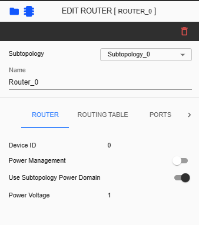
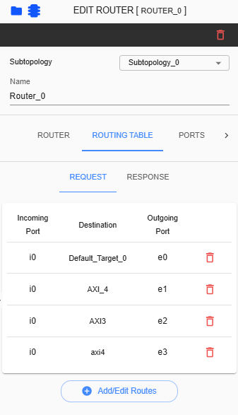
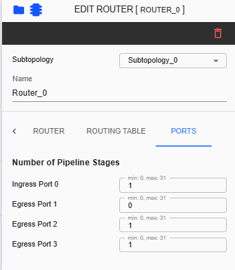

Router Configuration 
=============================================

Configuring a router includes setting up the power, Ports (Pipeline Stages) routing table. To start editing the router settings, the user must click on the router in the grid.

In this tab, users can configure specific settings for each selected router.

In the Routing Table tab, route configurations are displayed. All ports with connections can be selected within their reachability.

In the Ports tab, the number of pipeline stages for each connected device is displayed. All AXI devices display 1 as the default number of stages, while egress link, AHB, APB, and SRAM devices display 0 as the default value. SEC, ingress link, and SIG-NATIVE devices do not display pipeline stages.

**Subtopology** – A dropdown list allows users to change the subtopology assigned to the selected Router. This dropdown can be modified and reassigned to another available subtopology based on the topology configuration.

**Device ID** - This ID is unique for each component

**Name** – Label name assigned for selected router. This is an input field where only alphanumeric keys and underscores are allowed. 

**Power Management** – Enabling or disabling power management in a specific router. 

**Use Subtopology Power Domain** – When enabled, the selected router will follow the power domain of the subtopology. If disabled, the power voltage of the selected router must be configured manually.

**Power Voltage** - This parameter displays the current project's Power Voltage. It will only differ for a specific router when ‘Use Subtopology Power Domain’ is disabled and the user has configured a different Power Voltage for the selected router. 

