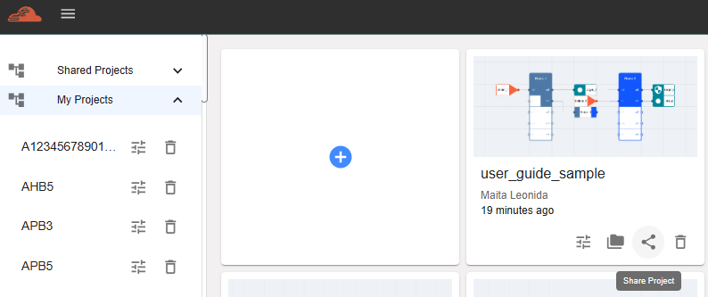
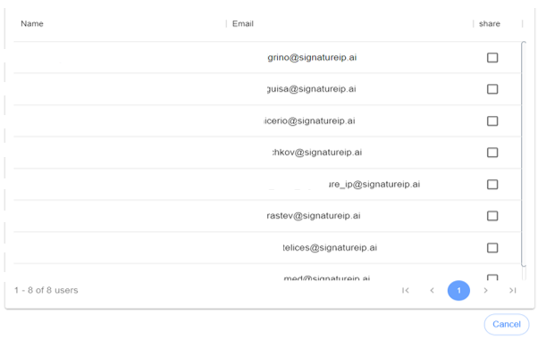
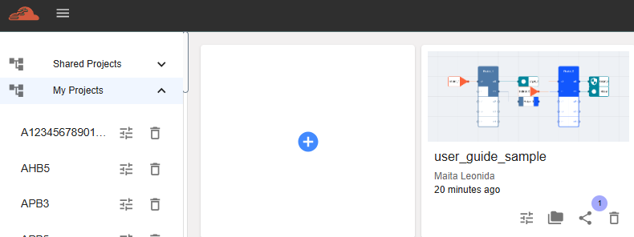
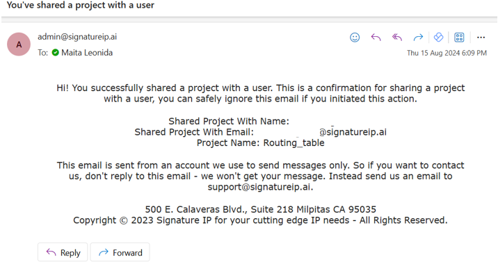
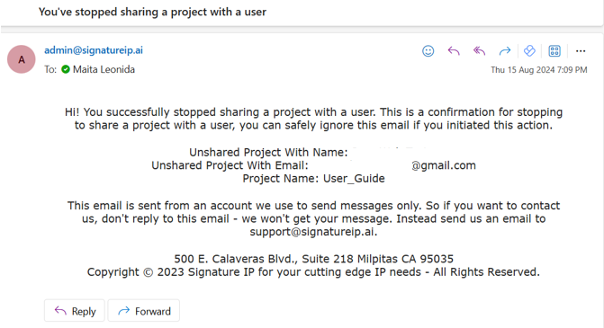

Shared Project
=============================================

This feature allows the user to share the chosen project with anyone from their group. To execute this, follow the steps below. 

Go to dashboard and click the ‘Share Project’ icon. 

A new window will be displayed, containing all the names from the same group. The user must choose who will receive the shared project. 

Tick the checkbox next to the name of the user who will receive a copy of the project. Untick the checkbox to revert the sharing.

An email notification will be received once the sharing is successful, confirming that the user has performed the action.

Another email notification will be received once the owner stops sharing the project, serving as confirmation that the sharing has been discontinued. 

