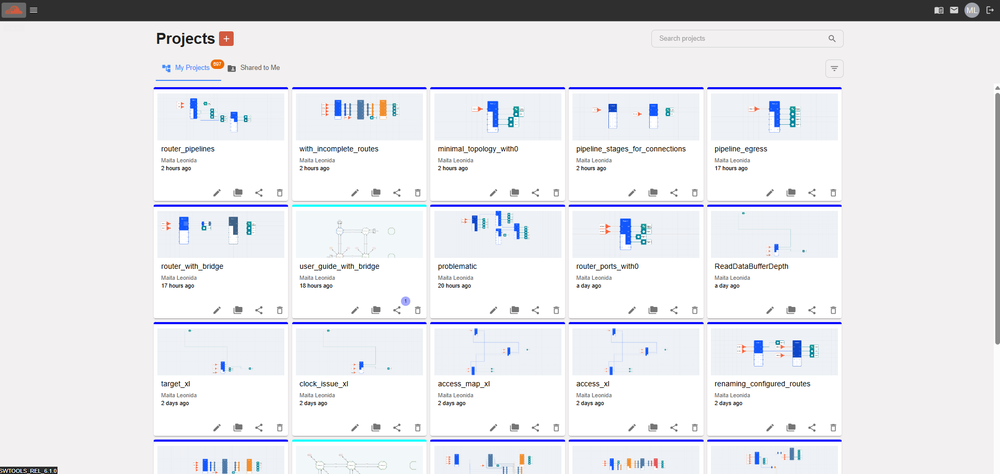
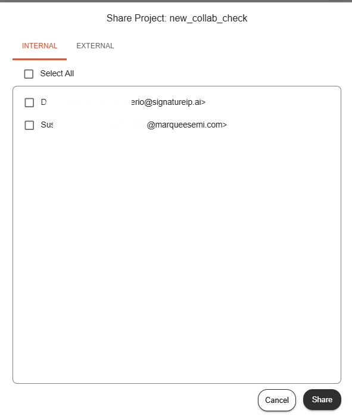
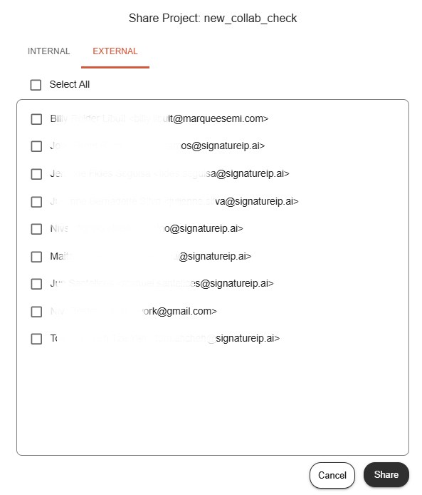
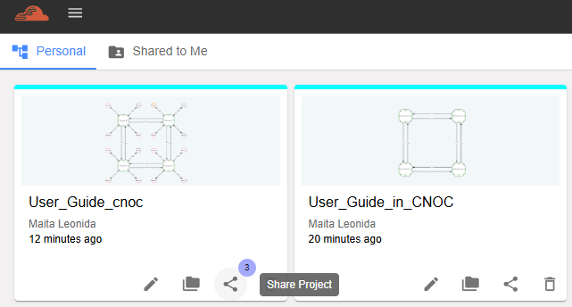
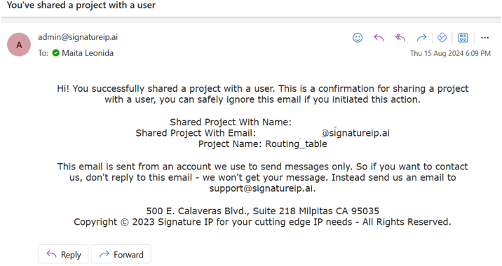
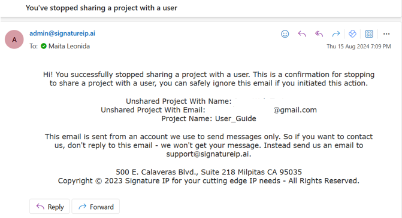
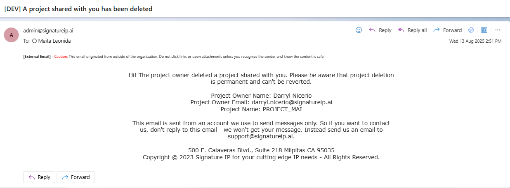

Shared Project
=============================================

This feature allows the user to share the chosen project with anyone from their group. To execute this, follow the steps below. 

1. Go to dashboard and click the ‘Share Project’ icon. 

2. A new window will be displayed, containing all the names from the same group. The user must choose who will receive the shared project. 

3. On the other tab, containing all the names from the collaborated group. The user can also choose who will receive the shared project. 

4. Tick the checkbox next to the name of the user who will receive a copy of the project. Untick the checkbox to revoke sharing. Once sharing is successful, a number will appear above the share icon on the project tile.

5. An email notification will be received once the sharing is successful, confirming that the user has performed the action.

6. Another email notification will be received once the owner stops sharing the project, serving as confirmation that the sharing has been discontinued. 

7. Once a shared project is deleted by the owner, the recipient receives an email notification informing them that the shared project was removed or deleted.

