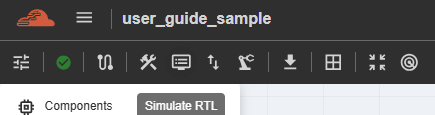
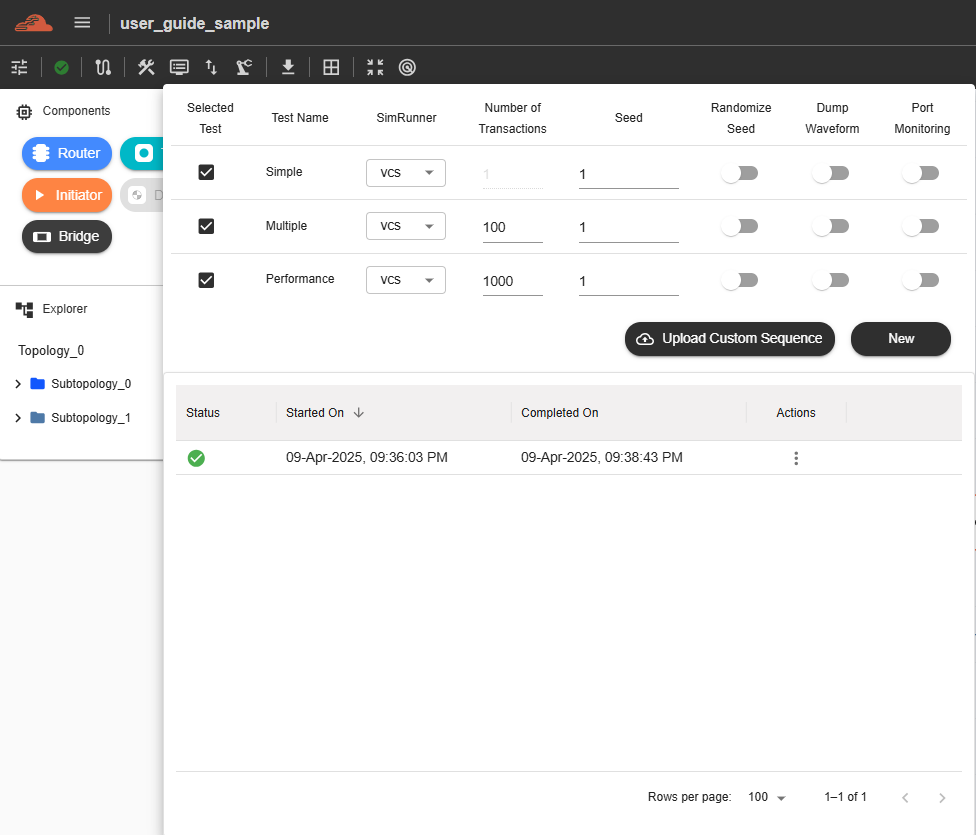
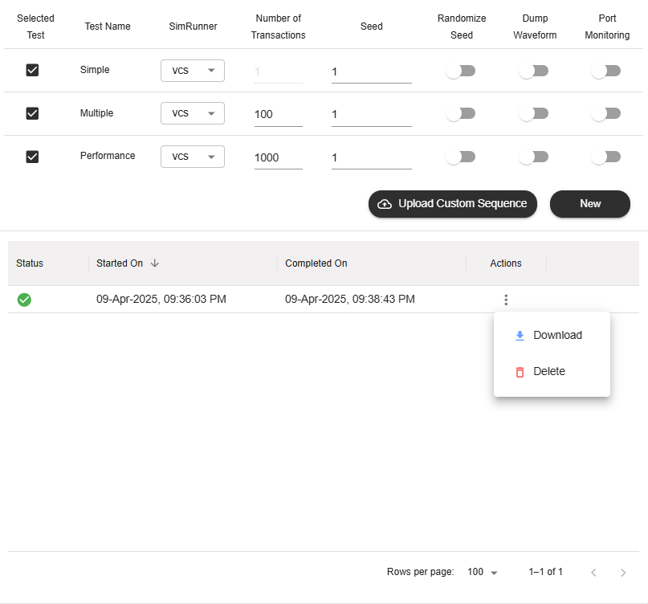

Simulation
======================================

Currently, this feature is for **NC-NoC** only. (SWTOOLS_REL_5.1.1). This feature is available depending on account accessibility. This feature is for running simulations and checking the results which are essential steps in digital design process to ensure that the RTL design functions as intended. There are three types of tests to run simulations: Simple, Multiple, and Performance. 

To run a test, the user can configure various parameters, including SimRunner, Number of Transactions, and Seed. The user can also enable or disable the Randomize Seed, Dump Waveform, and Port Monitoring. Additionally, the user can choose to run tests simultaneously or one by one by checking or unchecking the test names.

After configuring all columns based on user needs, click the ‘New’ button to start the simulation process. 

All results will be displayed below the table, including Status, Start, and Completion timestamps

Each result includes an ‘Action’ column, where the user can choose to either ‘Download’ or ‘Delete’ the result. The download option depends on the license assigned to the user’s group.
