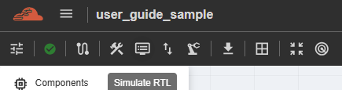
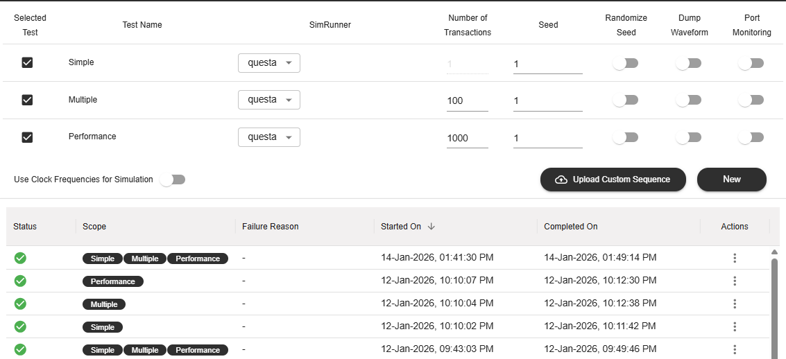
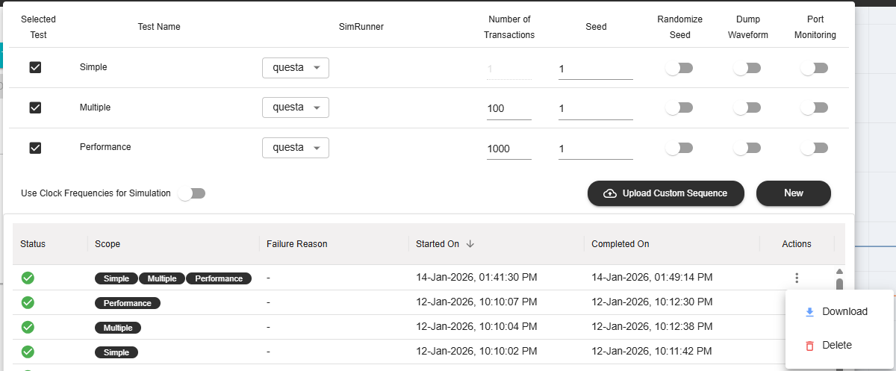

===================================================
NC-NoC Simulation and Cycle-Accurate Verification
===================================================

The **Simulation Engine** provides a cycle-level validation workspace to verify the functional correctness and bandwidth profiles of your compiled Non-Coherent NoC (NC-NoC) topologies. This layer lets you stress-test synthesizable register-transfer level (RTL) files against customizable traffic generation patterns before launching downstream hardware synthesis.

--------------------------------------------------------------------------------

Platform Constraints & Licensing Boundaries
==============================================

.. note::
   **Release Dependency Matrix:**
   
   * **Topology Constraints:** As of release **SWTOOLS_REL_5.1.1**, simulation execution pipelines are compiled exclusively for **NC-NoC** architecture frameworks. 
   * **License Entitlements:** Access to remote compute clusters and test benches is dynamically regulated by your assigned tenant profile. Connect with your Group Admin to audit transaction seat balances if simulation buttons appear grayed out.

--------------------------------------------------------------------------------

Core Simulation Profiles
============================

The validation matrix provides three distinct execution tiers to evaluate link throughput, congestion boundaries, and protocol boundary limits:

.. list-table:: Test Execution Frameworks
   :widths: 25 75
   :header-rows: 1
   :stub-columns: 1

   * - Test Classification
     - Verification Scope & Objectives
   * - **Simple Test**
     - Targets single point-to-point transaction streams to check baseline routing mechanics, clock domain crossings (CDC), and individual address decoding steps.
   * - **Multiple Test**
     - Dispatches concurrent, mixed transaction profiles across split crossbar pathways to isolate structural buffer blocking and routing conflicts.
   * - **Performance Test**
     - Floods the switch network with saturating wire traffic patterns to compute maximum latency inflection points, link saturation flags, and tail-latency curves.

--------------------------------------------------------------------------------

Test Execution & Parameter Configurations
=============================================

To execute a test verification run, customize your validation parameters directly inside the interactive simulation rows:

.. grid:: 2
   :gutter: 3

   .. grid-item-card:: Primary Seed & Runtime Knobs
      :class-header: bg-light font-weight-bold

      * **SimRunner Selector:** Sets the base simulation compiler engine and underlying behavioral verification solver block.
      * **Number of Transactions:** Defines the exact transaction loop or burst frame limit processed by the master initiator nodes before gracefully closing the test bench run.
      * **Seed Input Matrix:** Sets the static integer seed to guarantee bit-precise reproducibility of pseudo-random traffic stress patterns.

   .. grid-item-card:: Debugging & Tracing Toggles
      :class-header: bg-light font-weight-bold

      * **Randomize Seed:** Toggles on automatic structural seed mutation across sequential runs to discover hidden corner-case deadlocks.
      * **Dump Waveform:** Compiles and outputs native Value Change Dump (``.vcd``) signal logs for deep local trace analysis.
      * **Port Monitoring:** Actively samples internal router channel buffers to build localized throughput telemetry reports.

.. hint::
   **Batch Test Processing:**
   You can run multiple test suites at the same time or isolate single runs by checking or unchecking the selection boxes located next to each test entry row.

--------------------------------------------------------------------------------

Managing Test Runs & Tracking Logs
=======================================

Once configuration parameters match your target profiling constraints, click the primary **New** button to bundle your design files and dispatch the job container to the verification cluster.

The system logs active builds directly inside the trace tracking layout table, recording critical parameters across the entire simulation runtime lifecycle:

Status Trace
   Renders real-time execution states (e.g., ``Pending``, ``Running``, ``Passed``, or ``Failed``) straight from the build server.

Timestamps
   Logs exact start and completion dates to let teams benchmark structural compile times between different design variations.

Action Controls
   Click the **Ellipsis Action Column** items to interact with compiled log assets:
   
   * **Download:** Packages and pulls down the compiled transaction log matrices, performance data, and waveform traces straight to your workstation downloads folder *(availability governed by group license limits)*.
   * **Delete:** Permanently purges the targeted validation folder container from your history log to clean up your workspace footprint.

--------------------------------------------------------------------------------------------------------------------------------------

Branch Selection in Task Windows [Simulation]
=================================================

The task window interface includes a branch selector that allows authorized users to target specific code/configuration branches directly within their active session.

Features & Access Control [Simulation]
-------------------------------------------

* **Visibility:** 
  The branch select dropdown is restricted and **visible only to internal users** belonging to authorized groups (`SignatureIP`, `SAdmins`, and designated internal groups). External or standard users will not see this control in the task window.
* **Default Branch:** 
  Upon initial load, the selector defaults to the active branch configured globally within the **admin page group settings**.
* **Persistence:** 
  Any manual branch selection made by a user is automatically saved to local storage (`localStorage`) to preserve their preference across sessions and window reloads.

UI & Configuration Reference [Simulation]
------------------------------------------------

.. list-table:: Task Window Branch Selector Properties
   :widths: 30 70
   :header-rows: 1

   * - Property
     - Description
   * - **Component Location**
     - Task window header / control panel toolbar.
   * - **Authorized Roles**
     - ``SignatureIP``, ``SAdmins``, internal group members.
   * - **Storage Key**
     - ``task_window_selected_branch``
   * - **Fallback / Default**
     - Admin page group active branch configuration.

Usage Example [Simulation]
-----------------------------------

When an internal user opens a task window, the component checks user group permissions:

1. **Permission Check:** Validates if the user session contains internal privileges.
2. **State Initialization:** Reads from storage or falls back to the admin-defined active branch.
3. **Event Triggering:** Dispatches a ``taskBranchChanged`` event whenever a new branch is selected, updating downstream task processes dynamically.
