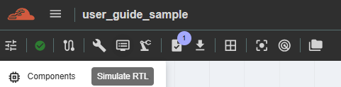
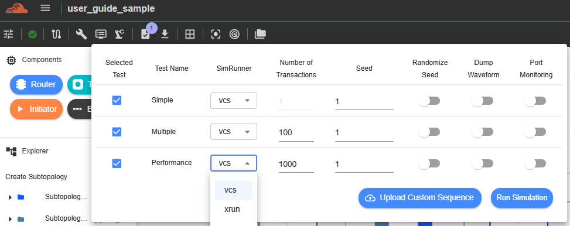
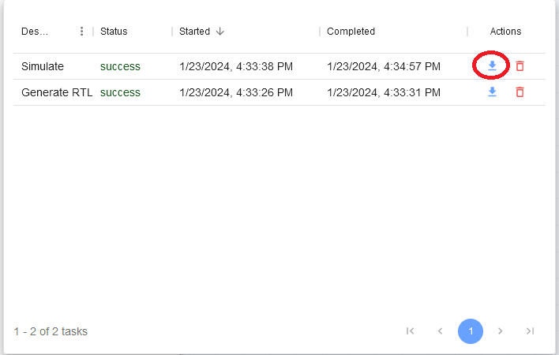

Simulation
======================================

Currently, this feature is for NC-NoC only. (SWTOOLS_REL_5.1.1). This feature is for running simulations and checking the results which are essential steps in digital design process to ensure that the RTL design functions as intended. There are three types of tests to run simulations: Simple, Multiple, and Performance. 

To run a test, the user can configure various parameters, including SimRunner, Number of Transactions, and Seed. The user can also enable or disable the Randomize Seed option and the Dump Waveform feature. Additionally, the user can choose to run tests simultaneously or one by one by checking or unchecking the test names.

Test results can be viewed inside the 'Results' section and can also be downloaded.

This feature is available depending on account accessibility. Please contact your group admin regarding this function, as it is managed on the group-admin side.
