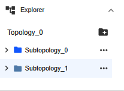
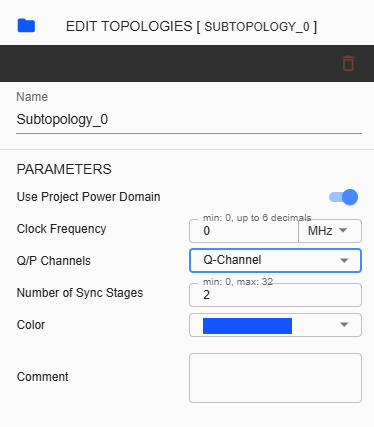
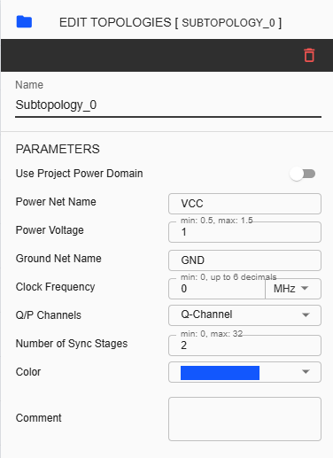

Subtopology Configuration
============================================

A subtopology is a subset of a topology. A complete topology can be divided into multiple subtopologies. In iNoCulator, this is represented as a folder containing components that are connected to each other using a bridge or pipeline. To learn how to design, follow these procedures:

1.	Initially, upon creating a project, one subtopology folder is created by default. When a user adds components, those components will be added in one subtopology folder. To create another subtopology, click ‘Add new Subtopology’ from Explorer. 

2.	A new subtopology folder will be displayed under the default subtopology folder. While the second folder is selected, all additional components will be assigned to the second folder

To configure the Subtopology folder, click any folder you need to modify then right-side panel will appear. Subtopology settings will be displayed like this:

**Name** – Label name assigned for selected subtopology folder. This is an input field where only alphanumeric keys and underscores are allowed. 

**Color** – User can choose any color assignment for the folder. This color also reflects in Router display. 

**Comment** – User can input comments to describe the folder or subtopology. 

**Clock Frequency** - This refers to the speed at which a processor can execute instructions. By default, the value displayed here is 0. The value set here will be reflected in initiators and targets when the device's Use Subtopology Clock is enabled. 

**Q/P Channels** – This parameter refers to the channel that will be used for a subtopology. The user can select between None, Q-Channel, and P-Channel. If Q-Channel or P-Channel is selected, another parameter will appear.

**Number of Sync Stages** – This input field will appear after selecting either Q-Channel or P-Channel. The user can set the stages from 0 to 32.

**Use Project Power Domain** – Default as enabled. This means that overall project power domain is used. When disabled, configuration of Power is available.

**Power Net Name** – This field is for naming Power Net. 

**Ground Net Name** – This field is for naming Ground Net Name. 

**Power Voltage** – This field is used to set the power voltage for the NoC project. The minimum configuration is 0.5, and the maximum configuration is 1.5.

