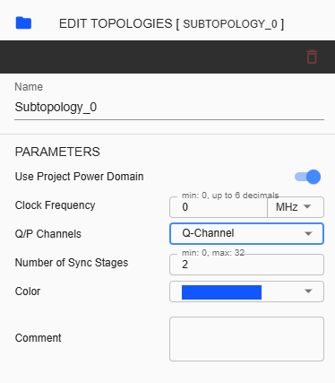

============================================
Subtopology Partition Configuration
============================================

A **Subtopology** is a structurally isolated subset or localized spatial cluster partition within a master global Network-on-Chip (NoC) topology canvas layout. Dividing a large-scale SoC interconnect into multiple subtopologies allows hardware architects to establish independent clock domains, isolate distinct power rails, and manage localized component routing envelopes using bridges or pipeline boundaries.

--------------------------------------------------------------------------------

Creating and Allocating Subtopology Clusters
================================================

Follow this sequential workflow to initialize structural folder partitions inside your project tree:

.. grid:: 1
   :gutter: 3

   .. grid-item-card:: Step 1: Initialize a New Domain Container
      :class-header: bg-light font-weight-bold

      **Explorer Tree Interaction**
      
      Upon project initialization, the engine instantiates a single default subtopology container. All newly dropped canvas elements route into this root partition. To split your fabric, navigate to the left-side **Explorer** tree panel and click **Add new Subtopology**.
      
      .. image:: images/subtopology-add_new_folder2.png
         :alt: Explorer tree architecture layout panel showing the addition of a secondary subtopology folder node
         :align: center
         :width: 70%

   .. grid-item-card:: Step 2: Bind Component Groups to Active Viewports
      :class-header: bg-light font-weight-bold

      **Target Partition Allocation**
      
      Select the newly appended subtopology folder node inside the directory list. While this secondary container remains active, any new initiators, routers, or target IP endpoints placed onto the canvas grid are automatically bound to this specific sub-domain context.

--------------------------------------------------------------------------------

Subtopology Property Settings Matrix
==========================================

Clicking any subtopology container node inside the Explorer layout populated a contextual properties inspector panel on the right-hand side of the workspace.

Global & Clocking Parameters
----------------------------------

Name
   The custom string label assigned to the subtopology directory folder. The input parser restricts strings strictly to **alphanumeric keys and underscores** (no spaces or special symbols).

Color
   A visual color token assigned to the folder block. Choosing a unique identifier applies a matching tint overlay to all internal child Router blocks populated within this specific partition layout.

Comment
   An open text block to document internal design descriptions, module intents, or revision tracking notes.

Clock Frequency
   Establishes the base clock speed parameter for the entire subtopology partition loop. Defaulst to ``0``. When downstream child Initiators or Targets leave their internal *Use Subtopology Clock* box checked, they dynamically inherit this frequency attribute. Accepts values scaled in Megahertz (``MHz``) or Gigahertz (``GHz``).

--------------------------------------------------------------------------------

Low-Power Sideband Management (AMBA LPSC)
==============================================

To support structural power-down states, you can deploy hardware sideband handshakes across the subtopology boundary by setting up standard AMBA Low Power State Control interfaces:

.. tab-set::

   .. tab-item:: Quiescence & Power Tunnels

      * **Q/P Channels Dropdown:** Configures the hardware sideband coordination mechanism. Select between ``None``, ``Q-Channel`` (for clock gating and simple quiescence handling), or ``P-Channel`` (for power/voltage domain transitions).
      * **Number of Sync Stages:** Active when either Q or P handshaking channels are configured. Specifies the length of the internal flip-flop synchronization pipeline register string to prevent metastability across asynchronous boundaries. Accepts integer constraints from ``0`` to ``32``.

   .. tab-item:: Power Infrastructure Overrides

      .. image:: images/subtopology-properties_with_power_voltage4.png
         :alt: Expanded property sheet showing independent power grid net definitions and operating voltage bounds
         :align: center
         :width: 80%

      * **Use Project Power Domain:** **Enabled by default.** Forces the subtopology rail structure to track the global, project-wide voltage parameters. Disabling this checkbox breaks the link, unlocking individualized local control fields to define independent power domains.
      * **Power Net Name:** Specifies the unique string identifier for the positive supply voltage metal track rail allocation layer (e.g., ``VDD_CORE_M0``).
      * **Ground Net Name:** Specifies the structural net connection tag for the common ground return reference plane layout (e.g., ``VSS``).
      * **Power Voltage:** Declares the absolute steady-state structural supply potential assigned across the partition's internal switch cells.

--------------------------------------------------------------------------------

⚠️ Voltage Range Validation Safeguards
========================================

.. warning::
   **Strict Physical Design Thresholds:**
   
   When defining isolated power rails with *Use Project Power Domain* disabled, the integrated design rule check (DRC) engine imposes strict, hard-coded bounding values on the **Power Voltage** entry:
   
   * **Minimum Level Constraints:** ``0.5 V`` (Core drop limit before systemic register state collapse)
   * **Maximum Level Constraints:** ``1.5 V`` (Maximum thermal-die dissipation and gate-oxide oxide stress ceiling)
   
   Submitting values outside this hardware validation bracket will trigger an instant interface compilation fault and block downstream RTL synthesis script generations.
