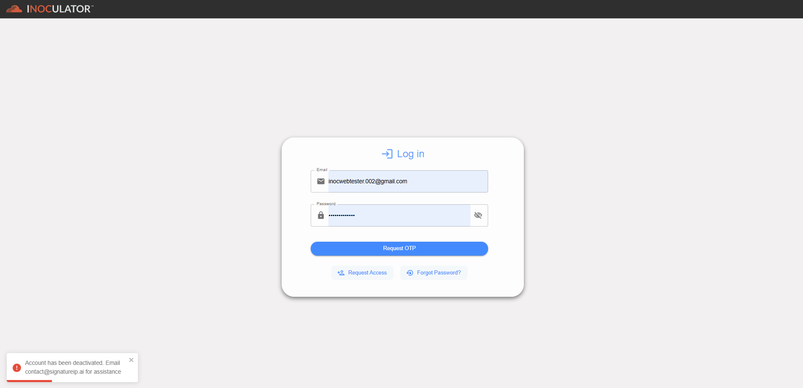

Suspended Account 
========================================================
A suspended account is one that has been temporarily disabled or restricted by the administrator, often due to a violation of terms of service, suspicious activity, or a pending investigation. 

To resolve this, contact support, the Group Admin, or the Signature IP Administrator to lift the suspension. However, this may require specific actions, such as resolving an issue.
