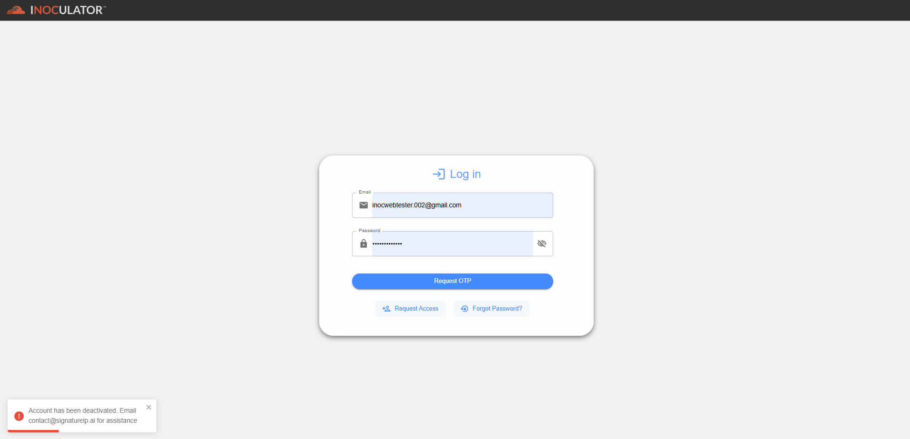

========================================================
Account Suspension and Access Restriction
========================================================

An account enters a **Suspended** state when security policies, administrative blocks, or licensing audits temporarily disable or restrict system access tokens. When an account is suspended, all local design canvas updates, simulation pipeline jobs, and collaboration sharing permissions are instantly frozen.

--------------------------------------------------------------------------------

Suspended System Identification
==================================

When a restricted profile attempts to authenticate or load the main engineering dashboard layout, the platform blocks entry and displays a system isolation banner.

.. error::
   **Access Tokens Temporarily Invalidated:**
   
   If you encounter this restriction layout, your user credentials remain stored in the master registry database, but active session execution tokens are blocked. Suspension triggers typically occur due to:
   
   * **Terms of Service (ToS) Compliance:** Detection of account sharing or unauthorized data extraction signatures.
   * **Security/Suspicious Behavior:** Concurrent login collisions across conflicting geographical network zones.
   * **Administrative Audits:** Pending organizational compliance reviews or overdue multi-tenant seat licensing renewals.

--------------------------------------------------------------------------------

Resolution & Restoration Procedures
======================================

To restore full canvas editing permissions, you must contact your authorized domain control team to lift the suspension state. Review the matrix below to pinpoint your primary escalation path depending on your deployment model:

.. grid:: 3
   :gutter: 3

   .. grid-item-card:: Group Administrator
      :class-header: bg-light font-weight-bold

      **Internal Tenant Level**
      
      If your workstation belongs to a shared corporate team workspace, your local **Group Admin** can audit your profile state, check internal compliance issues, and toggle your access toggle back to active.

   .. grid-item-card:: Signature IP Admin
      :class-header: bg-light font-weight-bold

      **Platform Licensing Level**
      
      For issues linked to core IP block access boundaries, evaluation license expiration dates, or site contract limits, request an audit from the **Signature IP Administrator**.

   .. grid-item-card:: Global Support Desk
      :class-header: bg-light font-weight-bold

      **Infrastructure Helpdesk**
      
      If administrative context remains unclear, submit an escalation ticket directly to the platform system helpdesk detailing your username and corporate site ID string.

.. hint::
   **Required Remediation Actions:**
   Restoring full system access is rarely an automated process. Depending on why the account was flagged, restoration may be gated behind explicit remediation tasks, such as clearing local network proxy conflicts, verifying multi-factor authentication tokens, or completing compliance updates.
